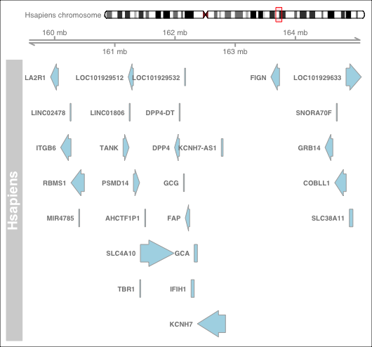
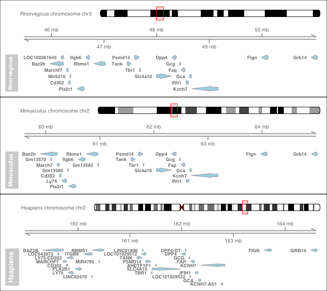

# SyntenyViz

|Branch|Status|
|:---:|---|
|`master`|[](https://travis-ci.org/DPP4ResearchGroup/SyntenyViz)|
|`develop`|[](https://travis-ci.org/DPP4ResearchGroup/SyntenyViz)|

## What is SyntenyViz
SyntenyViz is a R package to visualise synteny across various biological species.

## Motivation
Visualising the synteny across species not only enables intuitive examination and facilitates reconstruction effort of ancestral genomes, but also allow more direct interrogation of gene regulations and gene structures within a gene cluster.

## Installation
### Install from RStudio
* Install and load `devtools`
```
install.packages("devtools")
library(devtools)
```
* Install and load `SyntenyViz` from `GitHub`
```
install_github("DPP4ResearchGroup/SyntenyViz")
library(SyntenyViz)
```

## Quick Start for the Inpatients
Quick and minimum steps to get start a synteney conservation anaysis with SyntenyViz

* Define an investigation range
We need to firstly define an investigation range to cover the target range in gene coordinate. We will use a mouse dipeptidyl dipeptidase 4 gene (DPP4-mm) in this example, where DPP4-mm locates at chromosome number 2 between 62,330,073-62,412,231 bp.  
```
# orgm is a handle for organism
orgmName <- "Mmusculus"
# mycoords.list is the investigation range handler
mycoords <- "2:6.0e7:6.5e7"
```
* Convert `mycoords.list` into a GRange object
```
mycoords.gr <- SyntenyViz::coordFormat (mycoords.list = mycoords)
```
It is always a good habit to double check the input, so
```
mycoords.gr
```
* Construct a single synteny graph
```
synvizPlot(mycoords.gr, orgmName)
```

* Construct a multi synteny graph

Pick a few of targets
```
orgm.1 <- "Hsapiens"
mycoords.list.1 <- "2:15.95e7:16.45e7"
orgm.2 <- "Mmusculus"
mycoords.list.2 <- "2:6.0e7:6.5e7"
orgm.3 <- "Rnorvegicus"
mycoords.list.3 <- "3:4.6e7:5.1e7"
```
Then construct a multiple synteny query
```
orgmsList <- orgmsCollection.init (orgmsList)
orgmsList <- orgmsAdd (orgm.1, orgmTxDB, mycoords.list.1, orgmsList)
orgmsList <- orgmsAdd (orgm.2, orgmTxDB, mycoords.list.2, orgmsList)
orgmsList <- orgmsAdd (orgm.3, orgmTxDB, mycoords.list.3, orgmsList)
```
Now, construct a comparative multi-synteny graph
```
multiplot <- multisynvizPlots(orgmsList)
```

## Contribution
1. Fork to your contributing account
1. Create your feature branch (`git checkout -b my-new-feature`)
1. Commit your changes (`git commit -am 'Added some feature'`)
1. Push to the feature branch (`git push origin my-new-feature`)
1. Create a new PR

## Issue Tracking
Issues and bugs can be raised and tracked through [GitHub issue tracker for SyntenyViz](https://github.com/DPP4ResearchGroup/SyntenyViz/issues).

## Unit Testing
`Travis` CI testing ([travis status](#SyntenyViz)) inplements `R CMD check`.
The function integrity is checked by `R` native `testthat`, which can also be invoked by utility function `devtools::test()` from RStudio.
