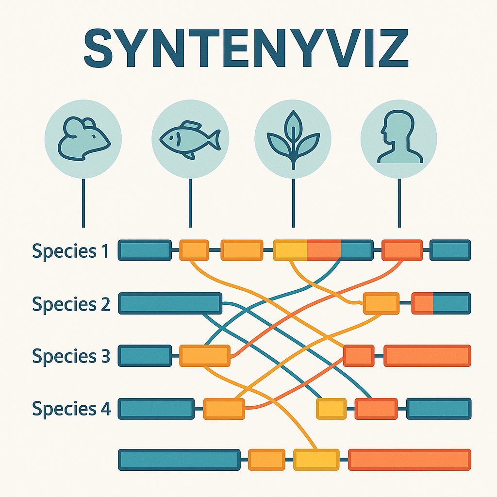

# `SyntenyViz` - a R package for Synteny Visulisation

## SyntenyViz



### Summary

#### What is SyntenyViz

SyntenyViz is a comprehensive R package for comparative genomics analysis, featuring synteny visualization, ortholog identification, coordinate retrieval, and synteny block analysis across various biological species.

##### Key Capabilities
- **Synteny Visualization**: Create publication-ready synteny plots for single and multi-species comparisons
- **Ortholog Analysis**: Identify orthologous genes and retrieve their genomic coordinates
- **Synteny Block Visualization**: Generate enhanced synteny plots with ortholog connections
- **Conservation Metrics**: Calculate comprehensive synteny conservation statistics
- **Evolutionary Analysis**: Integrate phylogenetic distances and evolutionary relationships

#### Motivation

Visualising the synteny across species not only enables intuitive examination and facilitates reconstruction effort of ancestral genomes, but also allow more direct interrogation of gene regulations and gene structures within a gene cluster. The enhanced ortholog coordinate retrieval and synteny block visualization capabilities provide researchers with powerful tools for detailed comparative genomic analysis.

### Release Status

#### UnitTests and Packaging Status

| Branch    | Status                                                                                                                                                                               |
|:---------:|--------------------------------------------------------------------------------------------------------------------------------------------------------------------------------------|
| `master`  | [](https://github.com/DPP4ResearchGroup/SyntenyViz/actions/workflows/r.yml)  |
| `develop` | [](https://github.com/DPP4ResearchGroup/SyntenyViz/actions/workflows/r.yml) |

#### Documentation Build/Deploy Status

| Stage                 | Status                                                                                                                                                                                                                          |
|:---------------------:|---------------------------------------------------------------------------------------------------------------------------------------------------------------------------------------------------------------------------------|
| `Documentation Build` | [](https://app.travis-ci.com/DPP4ResearchGroup/SyntenyViz)                                         |
|  `Manual Deployment`  | [](https://github.com/DPP4ResearchGroup/SyntenyViz/actions/workflows/pages/pages-build-deployment) |

## Operation Manuals

### Installation & Quick Start

#### Install within RStudio
* Install and load `devtools`

```
install.packages("devtools")
library(devtools)
```
* Install and load `SyntenyViz` from `GitHub`

```
install_github("DPP4ResearchGroup/SyntenyViz")
library(SyntenyViz)
```

To allow build vignettes, `build_vignettes = TRUE` options can be used as

```
install_github("DPP4ResearchGroup/SyntenyViz", build_vignettes = TRUE)
library(SyntenyViz)
```

Developing version can be accessed via `develop` as

```
install_github("DPP4ResearchGroup/SyntenyViz", ref = "develop")
library(SyntenyViz)
```

#### TL;DR - Quick Start for the Inpatients

Quick and minimum steps to get start a synteney conservation analysis with `SyntenyViz`

* Define an investigation range
  We need to firstly define an investigation range to cover the target range in gene coordinate. We will use a mouse dipeptidyl dipeptidase 4 gene (DPP4-mm) in this example, where DPP4-mm locates at chromosome number 2 between 62,330,073-62,412,231 bp.

```
# orgm is a handle for organism
orgmName <- "Mmusculus"
# mycoords.list is the investigation range handler
mycoords <- "2:6.0e7:6.5e7"
```
* Convert `mycoords.list` into a GRange object

```
mycoords.gr <- SyntenyViz::coordFormat (mycoords.list = mycoords)
```

It is always a good habit to double check the input, so

```
mycoords.gr
```
* Construct a single synteny graph

```
synvizPlot(mycoords.gr, orgmName)
```


* Construct a multi synteny graph

Pick a few of targets

```
orgm.1 <- "Hsapiens"
mycoords.list.1 <- "2:15.95e7:16.45e7"
orgm.2 <- "Mmusculus"
mycoords.list.2 <- "2:6.0e7:6.5e7"
orgm.3 <- "Rnorvegicus"
mycoords.list.3 <- "3:4.6e7:5.1e7"
```

Then construct a multiple synteny query

```
orgmsList <- orgmsCollection.init (orgmsList)
orgmsList <- orgmsAdd (orgm.1, orgmTxDB, mycoords.list.1, orgmsList)
orgmsList <- orgmsAdd (orgm.2, orgmTxDB, mycoords.list.2, orgmsList)
orgmsList <- orgmsAdd (orgm.3, orgmTxDB, mycoords.list.3, orgmsList)
```

Now, construct a comparative multi-synteny graph

```
multiplot <- multisynvizPlots(orgmsList)
```

**Note**: Due to heavy downloading and computing involved in this step, `multisynvizPlots` may take several minutes to complete.


### Ortholog Analysis in SyntenyViz

`SyntenyViz` provides comprehensive ortholog analysis capabilities, including ortholog identification, coordinate retrieval, and synteny block visualization. The package has a dependency on R package `orthogene` of version `1.12.0` or above for orthologs matching mechanism.

#### Ortholog Functions

##### 1. Ortholog Identification
- `getOrthHomolog()`: Search for orthologous genes across species
- Uses the `orthogene` package for high-confidence ortholog identification

##### 2. Ortholog Coordinate Retrieval
- `getOrthologCoordinates()`: Retrieve genomic coordinates for orthologous genes
- Maps orthologs to their genomic positions in both source and target species
- Returns structured data for synteny analysis

##### 3. Synteny Block Visualization
- `createSyntenyBlockData()`: Create synteny block data structures
- `plotSyntenyBlocks()`: Visualize synteny blocks with ortholog connections
- `getOrthologSyntenySummary()`: Generate synteny conservation metrics

#### Supported Species

As of version `1.12.0` stands, the following species are supported and can be searched against:

| Scientific Name               | Taxonomy ID | Source     | ID            | Scientific Name Formatted |
|-------------------------------|-------------|------------|---------------|---------------------------|
| Mus musculus                  | 10090       | homologene | mmusculus     | mus musculus              |
| Rattus norvegicus             | 10116       | homologene | rnorvegicus   | rattus norvegicus         |
| Kluyveromyces lactis          | 28985       | homologene | klactis       | kluyveromyces lactis      |
| Magnaporthe oryzae            | 318829      | homologene | moryzae       | magnaporthe oryzae        |
| Eremothecium gossypii         | 33169       | homologene | egossypii     | eremothecium gossypii     |
| Arabidopsis thaliana          | 3702        | homologene | athaliana     | arabidopsis thaliana      |
| Oryza sativa                  | 4530        | homologene | osativa       | oryza sativa              |
| Schizosaccharomyces pombe     | 4896        | homologene | spombe        | schizosaccharomyces pombe |
| Saccharomyces cerevisiae      | 4932        | homologene | scerevisiae   | saccharomyces cerevisiae  |
| Neurospora crassa             | 5141        | homologene | ncrassa       | neurospora crassa         |
| Caenorhabditis elegans        | 6239        | homologene | celegans      | caenorhabditis elegans    |
| Anopheles gambiae             | 7165        | homologene | agambiae      | anopheles gambiae         |
| Drosophila melanogaster       | 7227        | homologene | dmelanogaster | drosophila melanogaster   |
| Danio rerio                   | 7955        | homologene | drerio        | danio rerio               |
| Xenopus (Silurana) tropicalis | 8364        | homologene | xtropicalis   | xenopus tropicalis        |
| Gallus gallus                 | 9031        | homologene | ggallus       | gallus gallus             |
| Macaca mulatta                | 9544        | homologene | mmulatta      | macaca mulatta            |
| Pan troglodytes               | 9598        | homologene | ptroglodytes  | pan troglodytes           |
| Homo sapiens                  | 9606        | homologene | hsapiens      | homo sapiens              |
| Canis lupus familiaris        | 9615        | homologene | clfamiliaris  | canis lupus familiaris    |
| Bos taurus                    | 9913        | homologene | btaurus       | bos taurus                |

### Working Examples and Vignettes

`SyntenyViz` includes comprehensive examples and training materials demonstrating all package capabilities, including the new ortholog coordinate retrieval and synteny block visualization features.

#### Available Examples

##### Comprehensive User Example
- **File**: `examples/comprehensive_user_example.R`
- **Features**: Complete workflow including ortholog analysis, coordinate retrieval, and synteny block visualization
- **New Sections**:
  - Ortholog coordinate retrieval (Step 5.5)
  - Synteny block visualization (Step 5.6)

##### Vignettes

Access via `RStudio`:

```
install_github("DPP4ResearchGroup/SyntenyViz", build_vignettes = TRUE)
browseVignettes("SyntenyViz")
```

##### Online Documentation

A `PDF` can be accessed from `SyntenyViz` [homepage](https://dpp4researchgroup.github.io/SyntenyViz/).

#### New Features Demonstrated

- **Ortholog Coordinate Retrieval**: `getOrthologCoordinates()` function usage
- **Synteny Block Data Creation**: `createSyntenyBlockData()` workflow
- **Enhanced Visualization**: `plotSyntenyBlocks()` with comparative and overlay plot types
- **Conservation Metrics**: `getOrthologSyntenySummary()` for quantitative analysis

## Troubleshooting

### Common Issues in SyntenyViz

Below are some frequently encountered issues when using the SyntenyViz package, along with debugging tips and solutions.

---

#### 1. Package Not Loading or Not Found

**Symptoms:**
- Error: `there is no package called 'SyntenyViz'`
- Error: `could not find function ...`

**Debug Steps:**
- Ensure you have installed the package:

  ```r
  devtools::install()
  ```
- If developing, use:

  ```r
  devtools::load_all()
  ```
- Check your working directory is set to the package root.

---

#### 2. Missing Dependencies

**Symptoms:**
- Error messages about missing packages (e.g., `there is no package called 'orthogene'`).

**Debug Steps:**
- Run the dependency check function:

  ```r
  check_dependencies()
  ```
- Manually install missing packages:

  ```r
  install.packages("orthogene")
  BiocManager::install("GenomicRanges")
  ```

---

#### 3. `getOrthHomolog` Fails or Returns Empty

**Symptoms:**
- Error: `object 'getOrthHomolog' not found`
- Function returns `NULL` or empty data frame.

**Debug Steps:**
- Make sure the package is loaded (see above).
- Check that you are using valid species names and gene IDs.
- Use the debug mode for more information:

  ```r
  getOrthHomolog("mouse", "ENSG00000139618", debug = TRUE)
  ```
- Review the console output for specific error messages.

---

#### 4. Invalid Input Types

**Symptoms:**
- Error: `gene_id must be a character string`
- Error: `invalid gene_id_type`

**Debug Steps:**
- Ensure all function arguments are of the correct type (e.g., character strings for gene IDs).
- Refer to the function documentation for accepted values.

---

#### 5. Plotting or Visualization Issues

**Symptoms:**
- Plots do not appear.
- Error: `could not find function "plotSynteny"`

**Debug Steps:**
- Confirm that all plotting dependencies (e.g., Gviz, grid) are installed.
- Check that the plotting function is exported and loaded.
- Try running a minimal example from the documentation.

---

#### 6. General Debugging Tips

- Use the provided debugging script:

  ```r
  source("debug_package.R")
  main_debug()
  ```
- Check the [Debugging Guide](readme_docs/DEBUGGING_GUIDE.md) for more detailed instructions.
- If you encounter a new issue, try to isolate it with a minimal reproducible example.

---

If your issue is not listed here, please consult the [Issue Tracker](#issue-tracking) or open a new issue with detailed information.

## Maintenance

### CI/Unit Testing

`Travis` CI testing ([travis status](#SyntenyViz)) inplements `R CMD check`.
The function integrity is checked by `R` native `testthat`, which can also be invoked by utility function `devtools::test()` from RStudio.

### Issue Tracking

Issues and bugs can be raised and current feature requests can be tracked through [GitHub issue tracker for SyntenyViz](https://github.com/DPP4ResearchGroup/SyntenyViz/issues).

### To Contribute

1. Fork to your contributing account
2. Create your feature branch (`git checkout -b my-new-feature`)
3. Commit your changes (`git commit -am 'Added some feature'`)
4. Push to the feature branch (`git push origin my-new-feature`)
5. Create a new PR
