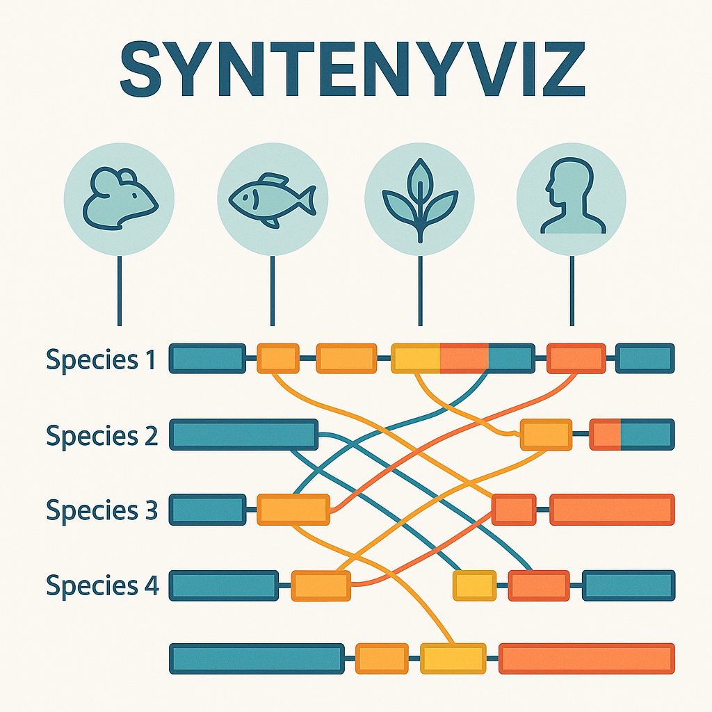
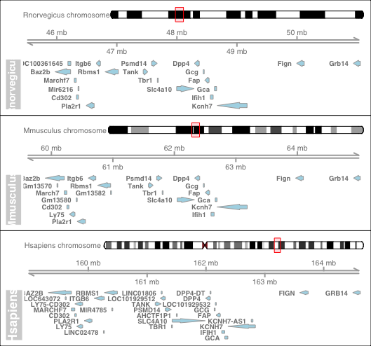

# `SyntenyViz` - a R package for Synteny Visulisation

## SyntenyViz



### Summary

#### What is SyntenyViz

SyntenyViz is a R package to visualise conservation of gene order (a.k.a. synteny) across various biological species.

#### Motivation

Visualising the synteny across species not only enables intuitive examination and facilitates reconstruction effort of ancestral genomes, but also allow more direct interrogation of gene regulations and gene structures within a gene cluster.

### Release Status

#### CI/CD Status

| Branch    | Status                                                                                                                                                                               |
|:---------:|--------------------------------------------------------------------------------------------------------------------------------------------------------------------------------------|
| `master`  | [](https://github.com/DPP4ResearchGroup/SyntenyViz/actions/workflows/r.yml)  |
| `develop` | [](https://github.com/DPP4ResearchGroup/SyntenyViz/actions/workflows/r.yml) |

#### Documentation Build/Deploy Status

| Branch    | Status                                                                                                                                               |
|:---------:|------------------------------------------------------------------------------------------------------------------------------------------------------|
| `master`  |                                                                                                                                                      |
| `develop` | [](https://app.travis-ci.com/DPP4ResearchGroup/SyntenyViz) |

## Operation Manuals

### Installation & Quick Start

#### Install within RStudio
* Install and load `devtools`

```
install.packages("devtools")
library(devtools)
```
* Install and load `SyntenyViz` from `GitHub`

```
install_github("DPP4ResearchGroup/SyntenyViz")
library(SyntenyViz)
```

To allow build vignettes, `build_vignettes = TRUE` options can be used as

```
install_github("DPP4ResearchGroup/SyntenyViz", build_vignettes = TRUE)
library(SyntenyViz)
```

Developing version can be accessed via `develop` as

```
install_github("DPP4ResearchGroup/SyntenyViz", ref = "develop")
library(SyntenyViz)
```

#### TL;DR - Quick Start for the Inpatients

Quick and minimum steps to get start a synteney conservation analysis with `SyntenyViz`

* Define an investigation range
  We need to firstly define an investigation range to cover the target range in gene coordinate. We will use a mouse dipeptidyl dipeptidase 4 gene (DPP4-mm) in this example, where DPP4-mm locates at chromosome number 2 between 62,330,073-62,412,231 bp.

```
# orgm is a handle for organism
orgmName <- "Mmusculus"
# mycoords.list is the investigation range handler
mycoords <- "2:6.0e7:6.5e7"
```
* Convert `mycoords.list` into a GRange object

```
mycoords.gr <- SyntenyViz::coordFormat (mycoords.list = mycoords)
```

It is always a good habit to double check the input, so

```
mycoords.gr
```
* Construct a single synteny graph

```
synvizPlot(mycoords.gr, orgmName)
```


* Construct a multi synteny graph

Pick a few of targets

```
orgm.1 <- "Hsapiens"
mycoords.list.1 <- "2:15.95e7:16.45e7"
orgm.2 <- "Mmusculus"
mycoords.list.2 <- "2:6.0e7:6.5e7"
orgm.3 <- "Rnorvegicus"
mycoords.list.3 <- "3:4.6e7:5.1e7"
```

Then construct a multiple synteny query

```
orgmsList <- orgmsCollection.init (orgmsList)
orgmsList <- orgmsAdd (orgm.1, orgmTxDB, mycoords.list.1, orgmsList)
orgmsList <- orgmsAdd (orgm.2, orgmTxDB, mycoords.list.2, orgmsList)
orgmsList <- orgmsAdd (orgm.3, orgmTxDB, mycoords.list.3, orgmsList)
```

Now, construct a comparative multi-synteny graph

```
multiplot <- multisynvizPlots(orgmsList)
```

**Note**: Due to heavy downloading and computing involved in this step, `multisynvizPlots` may take several minutes to complete.



### Searching Orthologs in a Target Spices

`SyntenyViz` has a dependency on R package `orthogene` of version `1.12.0` or above for orthologs matching mechanism. As of version `1.12.0` stands, the following species are supported and can be searched against.

| Scientific Name               | Taxonomy ID | Source     | ID            | Scientific Name Formatted |
|-------------------------------|-------------|------------|---------------|---------------------------|
| Mus musculus                  | 10090       | homologene | mmusculus     | mus musculus              |
| Rattus norvegicus             | 10116       | homologene | rnorvegicus   | rattus norvegicus         |
| Kluyveromyces lactis          | 28985       | homologene | klactis       | kluyveromyces lactis      |
| Magnaporthe oryzae            | 318829      | homologene | moryzae       | magnaporthe oryzae        |
| Eremothecium gossypii         | 33169       | homologene | egossypii     | eremothecium gossypii     |
| Arabidopsis thaliana          | 3702        | homologene | athaliana     | arabidopsis thaliana      |
| Oryza sativa                  | 4530        | homologene | osativa       | oryza sativa              |
| Schizosaccharomyces pombe     | 4896        | homologene | spombe        | schizosaccharomyces pombe |
| Saccharomyces cerevisiae      | 4932        | homologene | scerevisiae   | saccharomyces cerevisiae  |
| Neurospora crassa             | 5141        | homologene | ncrassa       | neurospora crassa         |
| Caenorhabditis elegans        | 6239        | homologene | celegans      | caenorhabditis elegans    |
| Anopheles gambiae             | 7165        | homologene | agambiae      | anopheles gambiae         |
| Drosophila melanogaster       | 7227        | homologene | dmelanogaster | drosophila melanogaster   |
| Danio rerio                   | 7955        | homologene | drerio        | danio rerio               |
| Xenopus (Silurana) tropicalis | 8364        | homologene | xtropicalis   | xenopus tropicalis        |
| Gallus gallus                 | 9031        | homologene | ggallus       | gallus gallus             |
| Macaca mulatta                | 9544        | homologene | mmulatta      | macaca mulatta            |
| Pan troglodytes               | 9598        | homologene | ptroglodytes  | pan troglodytes           |
| Homo sapiens                  | 9606        | homologene | hsapiens      | homo sapiens              |
| Canis lupus familiaris        | 9615        | homologene | clfamiliaris  | canis lupus familiaris    |
| Bos taurus                    | 9913        | homologene | btaurus       | bos taurus                |

### Working Examples and Vignettes

`SyntenyViz` also includes additional examples and training materials, which can be accessed via vignettes from `RStudio`

```
install_github("DPP4ResearchGroup/SyntenyViz", build_vignettes = TRUE)
browseVignettes("SyntenyViz")
```

OR a `PDF` can be accessed from `SyntenyViz` [homepage](https://dpp4researchgroup.github.io/SyntenyViz/).

## Troubleshooting & Debugging

### SyntenyViz Package Debugging Guide

#### Overview

This guide provides comprehensive debugging techniques for the SyntenyViz R package.

#### Quick Start

##### 1. Load Package for Development

```r
# In R console or RStudio
devtools::load_all()
```

##### 2. Run Debugging Script

```r
# Source the debugging script
source("debug_package.R")

# Run comprehensive debugging
main_debug()
```

##### 3. Test Individual Functions

```r
# Test the main function with debug mode
getOrthHomolog("mouse", "ENSG00000139618", debug = TRUE)

# Test with verbose mode
getOrthHomolog("mouse", "ENSG00000139618", verbose = TRUE)

# Test the new similarity function
orthologs <- getOrthHomolog("mouse", "ENSG00000139618")
similarity <- calculateOrthologSimilarity(orthologs, "human", "mouse", debug = TRUE)
```

#### Debugging Functions Available

##### `test_getOrthHomolog()`

Tests the main function with various scenarios:
- Normal cases
- Missing parameters
- Invalid inputs
- Error conditions
- Different input types

##### `test_calculateOrthologSimilarity()`

Tests the new similarity calculation function:
- Different similarity types (sequence, functional, evolutionary, composite, all)
- Various species pairs
- Error handling
- Input validation

##### `check_package_structure()`

Checks the package structure:
- DESCRIPTION file
- R files
- Test files
- Documentation files

##### `check_dependencies()`

Verifies all required packages are installed:
- orthogene
- dplyr
- BiocManager
- GenomicRanges
- Gviz
- stringr
- rlist
- grid

##### `test_with_sample_data()`

Tests the function with various sample data:
- Different species (mouse, rat, human)
- Different gene types (ensembl, symbol)
- Multiple gene IDs

##### `run_package_checks()`

Runs comprehensive package checks:
- devtools::check()
- devtools::test()

#### Common Debugging Techniques

##### 1. Interactive Debugging

```r
# Set breakpoint in function
debug(getOrthHomolog)

# Call function (will pause at breakpoint)
getOrthHomolog("mouse", "ENSG00000139618")

# Remove debug mode
undebug(getOrthHomolog)
```

##### 2. Step-by-Step Debugging

```r
# Add browser() statement in function
getOrthHomolog <- function(species, gene_id, ...) {
    browser()  # Execution will pause here
    # ... rest of function
}
```

##### 3. Error Recovery

```r
# Enable error recovery
options(error = recover)

# Call function that might error
getOrthHomolog("invalid", "invalid")

# Disable error recovery
options(error = NULL)
```

##### 4. Trace Function Calls

```r
# Trace function execution
trace(getOrthHomolog, browser)

# Call function (will pause at each line)
getOrthHomolog("mouse", "ENSG00000139618")

# Remove trace
untrace(getOrthHomolog)
```

#### Testing Commands

##### Run All Tests

```r
devtools::test()
```

##### Run Specific Test File

```r
devtools::test_file("tests/testthat/test_getOrthHomology.R")
```

##### Run Package Checks

```r
devtools::check()
```

##### Build Package

```r
devtools::build()
```

##### Install Package

```r
devtools::install()
```

#### Common Issues and Solutions

##### 1. Package Not Found

```r
# Install missing package
BiocManager::install("orthogene")
```

##### 2. Function Not Found

```r
# Check if function is exported
ls("package:SyntenyViz")
```

##### 3. Documentation Issues

```r
# Generate documentation
devtools::document()
```

##### 4. Test Failures

```r
# Run tests with verbose output
devtools::test(reporter = "verbose")
```

#### Debugging Checklist

- [ ] All required packages installed
- [ ] Package loads without errors
- [ ] Functions are properly exported
- [ ] Documentation is complete
- [ ] Tests pass
- [ ] Package checks pass
- [ ] Error handling works correctly
- [ ] Edge cases are handled
- [ ] Performance is acceptable

#### Performance Debugging

##### Profile Function Performance

```r
# Install profvis if not available
if (!requireNamespace("profvis", quietly = TRUE)) {
    install.packages("profvis")
}

# Profile function
profvis::profvis({
    getOrthHomolog("mouse", "ENSG00000139618")
})
```

##### Memory Usage

```r
# Check memory usage
pryr::mem_used()

# Profile memory
pryr::mem_change({
    result <- getOrthHomolog("mouse", "ENSG00000139618")
})
```

#### Advanced Debugging

##### 1. Mock Dependencies

```r
# Mock orthogene package for testing
mock_orthogene <- function(...) {
    data.frame(
        orthologous_gene = "MOCK_GENE",
        species = "mouse",
        stringsAsFactors = FALSE
    )
}

# Replace function temporarily
assignInNamespace("get_orthologs", mock_orthogene, "orthogene")
```

##### 2. Logging

```r
# Add logging to function
getOrthHomolog <- function(species, gene_id, ...) {
    message("DEBUG: Function called with species=", species, " gene_id=", gene_id)
    # ... rest of function
}
```

##### 3. Unit Testing with Mocks

```r
# Use testthat with mocking
library(testthat)
library(mockery)

test_that("function works with mocked data", {
    mock_get_orthologs <- mock(data.frame(gene = "test"))
    with_mock(
        get_orthologs = mock_get_orthologs,
        {
            result <- getOrthHomolog("mouse", "test")
            expect_equal(nrow(result), 1)
        }
    )
})
```

#### Troubleshooting

##### Common Error Messages

1. **"Package 'orthogene' is required but not installed"**
   - Solution: `BiocManager::install("orthogene")`

2. **"Function not found"**
   - Solution: Check if function is exported in NAMESPACE

3. **"Invalid 'gene_id_type'"**
   - Solution: Use only "ensembl_gene_id" or "symbol"

4. **"Both 'species' and 'gene_id' must be provided"**
   - Solution: Provide both parameters

##### Getting Help

1. Check the function documentation: `?getOrthHomolog`
2. Run the debugging script: `source("debug_package.R")`
3. Check package status: `devtools::check()`
4. Review test results: `devtools::test()`

#### Best Practices

1. **Always test with debug mode first**
2. **Use tryCatch for error handling**
3. **Validate inputs thoroughly**
4. **Test edge cases**
5. **Keep tests up to date**
6. **Document all functions**
7. **Use meaningful error messages**
8. **Profile performance regularly**

### Common Issues in SyntenyViz

Below are some frequently encountered issues when using the SyntenyViz package, along with debugging tips and solutions.

---

#### 1. Package Not Loading or Not Found

**Symptoms:**
- Error: `there is no package called 'SyntenyViz'`
- Error: `could not find function ...`

**Debug Steps:**
- Ensure you have installed the package:

  ```r
  devtools::install()
  ```
- If developing, use:

  ```r
  devtools::load_all()
  ```
- Check your working directory is set to the package root.

---

#### 2. Missing Dependencies

**Symptoms:**
- Error messages about missing packages (e.g., `there is no package called 'orthogene'`).

**Debug Steps:**
- Run the dependency check function:

  ```r
  check_dependencies()
  ```
- Manually install missing packages:

  ```r
  install.packages("orthogene")
  BiocManager::install("GenomicRanges")
  ```

---

#### 3. `getOrthHomolog` Fails or Returns Empty

**Symptoms:**
- Error: `object 'getOrthHomolog' not found`
- Function returns `NULL` or empty data frame.

**Debug Steps:**
- Make sure the package is loaded (see above).
- Check that you are using valid species names and gene IDs.
- Use the debug mode for more information:

  ```r
  getOrthHomolog("mouse", "ENSG00000139618", debug = TRUE)
  ```
- Review the console output for specific error messages.

---

#### 4. Invalid Input Types

**Symptoms:**
- Error: `gene_id must be a character string`
- Error: `invalid gene_id_type`

**Debug Steps:**
- Ensure all function arguments are of the correct type (e.g., character strings for gene IDs).
- Refer to the function documentation for accepted values.

---

#### 5. Plotting or Visualization Issues

**Symptoms:**
- Plots do not appear.
- Error: `could not find function "plotSynteny"`

**Debug Steps:**
- Confirm that all plotting dependencies (e.g., Gviz, grid) are installed.
- Check that the plotting function is exported and loaded.
- Try running a minimal example from the documentation.

---

#### 6. General Debugging Tips

- Use the provided debugging script:

  ```r
  source("debug_package.R")
  main_debug()
  ```
- Check the [Debugging Guide](#syntenyviz-package-debugging-guide) for more detailed instructions.
- If you encounter a new issue, try to isolate it with a minimal reproducible example.

---

If your issue is not listed here, please consult the [Issue Tracker](#issue-tracking) or open a new issue with detailed information.

## WIP

### CI/Unit Testing

`Travis` CI testing ([travis status](#SyntenyViz)) inplements `R CMD check`.
The function integrity is checked by `R` native `testthat`, which can also be invoked by utility function `devtools::test()` from RStudio.

### Issue Tracking

Issues and bugs can be raised and current feature requests can be tracked through [GitHub issue tracker for SyntenyViz](https://github.com/DPP4ResearchGroup/SyntenyViz/issues).

### To Contribute

1. Fork to your contributing account
2. Create your feature branch (`git checkout -b my-new-feature`)
3. Commit your changes (`git commit -am 'Added some feature'`)
4. Push to the feature branch (`git push origin my-new-feature`)
5. Create a new PR
