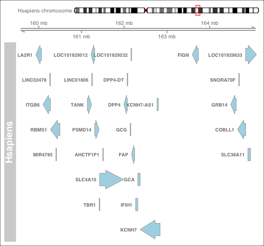

# What is SyntenyViz

SyntenyViz is a R package to visualise synteny across various biological species.

## Motivation

Visualising the synteny across species not only enables intuitive examination and facilitates reconstruction effort of ancestral genomes, but also allow more direct interrogation of gene regulations and gene structures within a gene cluster.

## Installation

### Install from RStudio

* Install and load `devtools`
```r
install.packages("devtools")
library(devtools)
```

* Install and load `SyntenyViz` from `GitHub`
```r
install_github("DPP4ResearchGroup/SyntenyViz")
library(SyntenyViz)
```

To allow build vignettes, `build_vignettes = TRUE` options can be used as
```r
install_github("DPP4ResearchGroup/SyntenyViz", build_vignettes = TRUE)
library(SyntenyViz)
```

Developing version can be accessed via `develop` as
```r
install_github("DPP4ResearchGroup/SyntenyViz", ref = "develop")
library(SyntenyViz)
```

## Quick Start for the Impatient

Quick and minimum steps to get started with a synteny conservation analysis using SyntenyViz.

### Define an investigation range

We need to first define an investigation range to cover the target range in gene coordinates. We will use a mouse dipeptidyl dipeptidase 4 gene (DPP4-mm) in this example, where DPP4-mm locates at chromosome number 2 between 62,330,073-62,412,231 bp.

```r
# orgm is a handle for organism
orgmName <- "Mmusculus"
# mycoords.list is the investigation range handler
mycoords <- "2:6.0e7:6.5e7"
```

### Convert coordinates into a GRange object

```r
mycoords.gr <- SyntenyViz::coordFormat(mycoords.list = mycoords)
```

It is always a good habit to double check the input, so:

```r
mycoords.gr
```

### Construct a single synteny graph

```r
synvizPlot(mycoords.gr, orgmName)
```



### Construct a multi-synteny graph

Pick a few targets:

```r
orgm.1 <- "Hsapiens"
mycoords.list.1 <- "2:15.95e7:16.45e7"
orgm.2 <- "Mmusculus"
mycoords.list.2 <- "2:6.0e7:6.5e7"
orgm.3 <- "Rnorvegicus"
mycoords.list.3 <- "3:4.6e7:5.1e7"
```

Then construct a multiple synteny query:

```r
orgmsList <- orgmsCollection.init(orgmsList)
orgmsList <- orgmsAdd(orgm.1, orgmTxDB, mycoords.list.1, orgmsList)
orgmsList <- orgmsAdd(orgm.2, orgmTxDB, mycoords.list.2, orgmsList)
orgmsList <- orgmsAdd(orgm.3, orgmTxDB, mycoords.list.3, orgmsList)
```

Now, construct a comparative multi-synteny graph:

```r
multiplot <- multisynvizPlots(orgmsList)
```


## Examples

`SyntenyViz` also includes training material, which can be accessed via vignettes from `RStudio`:

```r
install_github("DPP4ResearchGroup/SyntenyViz", build_vignettes = TRUE)
browseVignettes("SyntenyViz")
```

OR a `PDF` can be accessed from the [SyntenyViz homepage](https://dpp4researchgroup.github.io/SyntenyViz/).

## Contribution

1. Fork to your contributing account
2. Create your feature branch (`git checkout -b my-new-feature`)
3. Commit your changes (`git commit -am 'Added some feature'`)
4. Push to the feature branch (`git push origin my-new-feature`)
5. Create a new PR

## Issue Tracking

Issues and bugs can be raised and tracked through the [GitHub issue tracker for SyntenyViz](https://github.com/DPP4ResearchGroup/SyntenyViz/issues).

## Unit Testing

Travis CI testing implements `R CMD check`. The function integrity is checked by `R` native `testthat`, which can also be invoked by utility function `devtools::test()` from RStudio.
