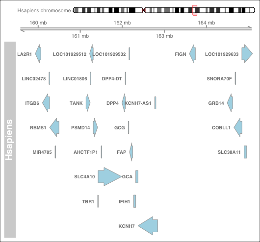

# Abstract

# Introduction
Synteny is the information about gene's distribution pattern on the chromosome.
Synteny analysis is widely used in studying complex genomes, as comparative genomics allows the presence and possibly function of genes in a simpler, model organism to infer those in a more complex one. In eukaryotes, synteny and linkage are often conserved for a surprisingly extended period. For example, many synteny blocks have been found in humans and mice, although the two species diverged from a common ancestor about 75 million years ago. [@KAWASHIMA2019257]

Visualizing the synteny across species not only enables intuitive examination and facilitates reconstruction effort of ancestral genomes, but also allow more direct interrogation of gene regulations and gene structures within a gene cluster.

SyntenyViz provides a quick and easy visualisation of synteny across various species with transcriptomics evidence.

# Methods

# References
