# SyntenyViz Function Logic Flowchart

## 🧬 Complete Function-Level Workflow and Scientific Data Processing

This comprehensive flowchart demonstrates the detailed scientific logic flow between all functions in the SyntenyViz package, showing how genomic data is processed through each computational step to produce rigorous comparative genomics analyses.

```mermaid
flowchart TD
    %% Start of Function Logic Flow
    START([🧬 Start: SyntenyViz Function Logic]) --> INPUT["📍 Input: Genomic Coordinate Strings<br/>Format: 'chr:start:end' (e.g., '2:16e7:16.5e7')<br/>Scientific Context: Defines genomic regions of interest"]
    
    %% Core Data Processing Functions
    INPUT --> COORD_FORMAT["🔧 coordFormat Function<br/>Purpose: Convert coordinate strings to GRanges objects<br/>Scientific Method: String parsing and genomic coordinate validation"]
    COORD_FORMAT --> COORD_LOGIC{"🔍 Parse Coordinate String<br/>Validation: Check format compliance<br/>Error Handling: Invalid coordinate detection"}
    COORD_LOGIC --> SPLIT["✂️ Split by ':' delimiter<br/>Method: String tokenization<br/>Output: [chromosome, start, end] array"]
    SPLIT --> CONVERT["🔢 Convert to numeric matrix<br/>Method: as.numeric() conversion<br/>Validation: Numeric range checking"]
    CONVERT --> GRANGES["📊 Create GRanges object<br/>Method: GenomicRanges::makeGRangesFromDataFrame()<br/>Scientific Output: Standardized genomic intervals"]
    GRANGES --> COORD_OUT["✅ Output: GRanges object<br/>Data Structure: GenomicRanges object<br/>Scientific Value: Standardized genomic coordinates"]
    
    %% Gene Annotation Functions
    COORD_OUT --> GENE_SUBSET["🧬 geneSubset Function<br/>Purpose: Extract and annotate genes from genomic regions<br/>Scientific Method: Database query and functional annotation"]
    GENE_SUBSET --> GET_PKGS["📚 getPkgs Function<br/>Purpose: Manage database package dependencies<br/>Scientific Context: Ensures proper annotation database access"]
    GET_PKGS --> PKGS_LOGIC{"🔍 Check Package Availability<br/>Validation: Package installation status<br/>Error Handling: Missing dependency detection"}
    PKGS_LOGIC --> LOAD_DB["📂 Load Annotation Database<br/>Method: Database connection establishment<br/>Scientific Context: Access to curated gene annotations"]
    LOAD_DB --> GET_ORG_DB["🏷️ getOrgDB Function<br/>Purpose: Retrieve organism-specific database<br/>Scientific Method: Species-specific annotation mapping"]
    GET_ORG_DB --> ORG_DB_LOGIC{"🔍 Retrieve Organism Database<br/>Validation: Species compatibility check<br/>Scientific Context: Taxonomic-specific gene annotations"}
    ORG_DB_LOGIC --> SYMBOL_DB["📝 Load Symbol Database<br/>Method: SYMBOL database connection<br/>Scientific Value: Gene symbol and identifier mapping"]
    SYMBOL_DB --> GET_TX_DB["📚 getTxDB Function<br/>Purpose: Access transcriptome database<br/>Scientific Method: Transcript-level annotation retrieval"]
    GET_TX_DB --> TX_DB_LOGIC{"🔍 Retrieve Transcriptome Database<br/>Validation: Transcript database availability<br/>Scientific Context: Gene structure and transcript information"}
    TX_DB_LOGIC --> GENE_QUERY["🔍 Query Genes in Range<br/>Method: Genomic range overlap detection<br/>Scientific Algorithm: findOverlaps() with genomic coordinates"]
    GENE_QUERY --> GENE_ANNOTATE["📋 Annotate Gene Information<br/>Method: Functional annotation retrieval<br/>Scientific Output: Gene symbols, GO terms, functional descriptions"]
    GENE_ANNOTATE --> GENE_OUT["✅ Output: Annotated Gene List<br/>Data Structure: Annotated gene data frame<br/>Scientific Value: Functionally annotated genomic features"]
    
    %% Visualization Functions
    GENE_OUT --> SYNVIZ_PLOT_DATA["📈 synvizPlotData Function<br/>Purpose: Prepare data for synteny visualization<br/>Scientific Method: Track object creation for genomic visualization"]
    SYNVIZ_PLOT_DATA --> PLOT_DATA_LOGIC{"🔍 Prepare Plot Data<br/>Validation: Data completeness check<br/>Scientific Context: Visualization data structure preparation"}
    PLOT_DATA_LOGIC --> ANNOTATION_TRACK["📊 Create AnnotationTrack<br/>Method: Gviz::AnnotationTrack()<br/>Scientific Output: Gene annotation visualization track"]
    ANNOTATION_TRACK --> GENOME_AXIS["📏 Create GenomeAxisTrack<br/>Method: Gviz::GenomeAxisTrack()<br/>Scientific Value: Genomic coordinate reference scale"]
    GENOME_AXIS --> IDEOGRAM["🧬 Create IdeogramTrack<br/>Method: Gviz::IdeogramTrack()<br/>Scientific Context: Chromosome structure visualization"]
    IDEOGRAM --> PLOT_DATA_OUT["✅ Output: Plot Data List<br/>Data Structure: List of Gviz track objects<br/>Scientific Value: Structured visualization components"]
    
    PLOT_DATA_OUT --> SYNVIZ_PLOT["🖼️ synvizPlot Function<br/>Purpose: Generate synteny visualization<br/>Scientific Method: Track combination and plot rendering"]
    SYNVIZ_PLOT --> PLOT_LOGIC{"🔍 Generate Visualization<br/>Validation: Track compatibility check<br/>Scientific Context: Multi-track genomic visualization"}
    PLOT_LOGIC --> COMBINE_TRACKS["🔗 Combine Tracks<br/>Method: Gviz::plotTracks()<br/>Scientific Algorithm: Track alignment and overlay"]
    COMBINE_TRACKS --> RENDER_PLOT["🎨 Render Plot<br/>Method: Gviz rendering engine<br/>Scientific Output: Publication-ready genomic visualization"]
    RENDER_PLOT --> PLOT_OUT["✅ Output: Synteny Plot<br/>Data Structure: Gviz plot object<br/>Scientific Value: Visual representation of gene organization"]
    
    %% Multi-Species Collection Functions
    PLOT_OUT --> ORGMS_COLLECTION_INIT["🏗️ orgmsCollection.init Function<br/>Purpose: Initialize multi-species collection<br/>Scientific Method: Collection data structure initialization"]
    ORGMS_COLLECTION_INIT --> INIT_LOGIC{"🔍 Initialize Collection<br/>Validation: Collection structure validation<br/>Scientific Context: Multi-species data organization"}
    INIT_LOGIC --> CREATE_COLLECTION["📦 Create Empty Collection<br/>Method: List structure initialization<br/>Scientific Output: Empty organism collection container"]
    CREATE_COLLECTION --> INIT_OUT["✅ Output: Empty Collection<br/>Data Structure: Initialized collection list<br/>Scientific Value: Multi-species analysis foundation"]
    
    INIT_OUT --> ORGMS_ADD["➕ orgmsAdd Function<br/>Purpose: Add organism to collection<br/>Scientific Method: Species data integration and validation"]
    ORGMS_ADD --> ADD_LOGIC{"🔍 Add Organism to Collection<br/>Validation: Species compatibility check<br/>Scientific Context: Taxonomic data integration"}
    ADD_LOGIC --> VALIDATE_ORG["✅ Validate Organism<br/>Method: Species database lookup<br/>Scientific Algorithm: Taxonomic validation"]
    VALIDATE_ORG --> ADD_TO_COLLECTION["📊 Add to Collection<br/>Method: Collection data structure update<br/>Scientific Output: Updated multi-species dataset"]
    ADD_TO_COLLECTION --> ADD_OUT["✅ Output: Updated Collection<br/>Data Structure: Enhanced collection with new species<br/>Scientific Value: Multi-species comparative dataset"]
    
    ADD_OUT --> MULTISYNVIZ_PLOTS["🌍 multisynvizPlots Function<br/>Purpose: Generate multi-species comparative plots<br/>Scientific Method: Cross-species visualization alignment"]
    MULTISYNVIZ_PLOTS --> MULTI_LOGIC{"🔍 Generate Multi-Species Plots<br/>Validation: Species data compatibility<br/>Scientific Context: Comparative genomic visualization"}
    MULTI_LOGIC --> ITERATE_SPECIES["🔄 Iterate Through Species<br/>Method: Species-wise plot generation<br/>Scientific Algorithm: Parallel species processing"]
    ITERATE_SPECIES --> COMBINE_PLOTS["🔗 Combine Individual Plots<br/>Method: Multi-panel plot arrangement<br/>Scientific Output: Aligned comparative visualization"]
    COMBINE_PLOTS --> MULTI_OUT["✅ Output: Multi-Species Plot<br/>Data Structure: Multi-panel Gviz plot<br/>Scientific Value: Cross-species synteny comparison"]
    
    %% Ortholog Analysis Functions
    MULTI_OUT --> GET_ORTH_HOMOLOG["🔗 getOrthHomolog Function<br/>Purpose: Identify orthologous gene pairs across species<br/>Scientific Method: Database query and phylogenetic analysis"]
    GET_ORTH_HOMOLOG --> ORTHO_LOGIC{"🔍 Search for Orthologs<br/>Validation: Species compatibility check<br/>Scientific Context: Homologous gene identification"}
    ORTHO_LOGIC --> QUERY_ORTHO["🔍 Query Ortholog Database<br/>Method: OrthoDB/Ensembl ortholog lookup<br/>Scientific Algorithm: Reciprocal best hit (RBH) analysis"]
    QUERY_ORTHO --> FILTER_ORTHO["🔍 Filter Ortholog Results<br/>Method: Confidence score filtering<br/>Scientific Criteria: E-value thresholds and coverage requirements"]
    FILTER_ORTHO --> ORTHO_OUT["✅ Output: Ortholog Pairs<br/>Data Structure: Ortholog relationship matrix<br/>Scientific Value: High-confidence homologous gene pairs"]
    
    %% Ortholog Coordinate Functions
    ORTHO_OUT --> GET_ORTH_COORDS["📍 getOrthologCoordinates Function<br/>Purpose: Retrieve genomic coordinates for orthologous genes<br/>Scientific Method: Coordinate mapping and validation"]
    GET_ORTH_COORDS --> COORDS_LOGIC{"🔍 Retrieve Ortholog Coordinates<br/>Validation: Species compatibility and coordinate validity<br/>Scientific Context: Genomic position mapping for orthologs"}
    COORDS_LOGIC --> EXTRACT_SOURCE["🧬 Extract Source Coordinates<br/>Method: geneSubset() for source species<br/>Scientific Algorithm: Genomic range overlap detection"]
    EXTRACT_SOURCE --> EXTRACT_TARGET["🧬 Extract Target Coordinates<br/>Method: geneSubset() for target species<br/>Scientific Algorithm: Ortholog-specific coordinate retrieval"]
    EXTRACT_TARGET --> MAP_ORTHOLOGS["🔗 Map Ortholog Coordinates<br/>Method: Coordinate matching and validation<br/>Scientific Output: Paired ortholog coordinate data"]
    MAP_ORTHOLOGS --> COORDS_OUT["✅ Output: Ortholog Coordinates<br/>Data Structure: Source and target coordinate matrices<br/>Scientific Value: Genomic position data for ortholog pairs"]
    
    COORDS_OUT --> CREATE_SYNTENY_DATA["🧬 createSyntenyBlockData Function<br/>Purpose: Create synteny block data structures for visualization<br/>Scientific Method: Relative positioning and connection mapping"]
    CREATE_SYNTENY_DATA --> SYNTENY_DATA_LOGIC{"🔍 Create Synteny Block Data<br/>Validation: Coordinate data completeness<br/>Scientific Context: Synteny block structure preparation"}
    SYNTENY_DATA_LOGIC --> CALC_RELATIVE["📐 Calculate Relative Positions<br/>Method: Normalized position calculation within regions<br/>Scientific Formula: (position - region_start) / region_length"]
    CALC_RELATIVE --> CREATE_CONNECTIONS["🔗 Create Ortholog Connections<br/>Method: Pair-wise ortholog mapping<br/>Scientific Algorithm: Connection matrix construction"]
    CREATE_CONNECTIONS --> SYNTENY_DATA_OUT["✅ Output: Synteny Block Data<br/>Data Structure: Structured synteny visualization data<br/>Scientific Value: Prepared data for comparative visualization"]
    
    SYNTENY_DATA_OUT --> PLOT_SYNTENY_BLOCKS["🎨 plotSyntenyBlocks Function<br/>Purpose: Visualize synteny blocks with ortholog connections<br/>Scientific Method: Gviz track-based visualization"]
    PLOT_SYNTENY_BLOCKS --> PLOT_LOGIC{"🔍 Generate Synteny Visualization<br/>Validation: Data structure compatibility<br/>Scientific Context: Comparative genomic visualization"}
    PLOT_LOGIC --> CREATE_TRACKS["📊 Create Gviz Tracks<br/>Method: AnnotationTrack, GenomeAxisTrack, IdeogramTrack<br/>Scientific Algorithm: Multi-track genomic visualization"]
    CREATE_TRACKS --> RENDER_SYNTENY["🎨 Render Synteny Plot<br/>Method: Gviz plotTracks() rendering<br/>Scientific Output: Publication-ready synteny visualization"]
    RENDER_SYNTENY --> PLOT_SYNTENY_OUT["✅ Output: Synteny Block Plot<br/>Data Structure: Gviz plot object<br/>Scientific Value: Visual representation of synteny conservation"]
    
    PLOT_SYNTENY_OUT --> GET_SYNTENY_SUMMARY["📊 getOrthologSyntenySummary Function<br/>Purpose: Generate synteny conservation metrics and statistics<br/>Scientific Method: Quantitative synteny analysis"]
    GET_SYNTENY_SUMMARY --> SUMMARY_LOGIC{"🔍 Calculate Synteny Metrics<br/>Validation: Data completeness and quality<br/>Scientific Context: Synteny conservation quantification"}
    SUMMARY_LOGIC --> CALC_COVERAGE["📈 Calculate Ortholog Coverage<br/>Method: Percentage of genes with orthologs<br/>Scientific Formula: (Orthologs found / Total genes) × 100"]
    CALC_COVERAGE --> CALC_CONSERVATION["🔄 Calculate Conservation Score<br/>Method: Synteny block size and density analysis<br/>Scientific Algorithm: Conservation metric integration"]
    CALC_CONSERVATION --> SUMMARY_OUT["✅ Output: Synteny Summary<br/>Data Structure: Comprehensive synteny metrics<br/>Scientific Value: Quantitative synteny conservation assessment"]
    
    %% Similarity Calculation Functions
    ORTHO_OUT --> CALC_SEQ_SIM["🧬 calculateSequenceSimilarity Function<br/>Purpose: Calculate DNA/protein sequence similarity<br/>Scientific Method: Sequence alignment and identity calculation"]
    CALC_SEQ_SIM --> SEQ_LOGIC{"🔍 Calculate Sequence Similarity<br/>Validation: Sequence quality check<br/>Scientific Context: Molecular sequence conservation analysis"}
    SEQ_LOGIC --> ALIGN_SEQUENCES["🔗 Align Sequences<br/>Method: BLAST/ClustalW alignment<br/>Scientific Algorithm: Pairwise sequence alignment"]
    ALIGN_SEQUENCES --> CALC_IDENTITY["📊 Calculate Identity Score<br/>Method: Identity percentage calculation<br/>Scientific Formula: (Identical positions / Total positions) × 100"]
    CALC_IDENTITY --> SEQ_SIM_OUT["✅ Output: Sequence Similarity Score<br/>Data Structure: Numeric similarity matrix<br/>Scientific Value: Quantitative sequence conservation metrics"]
    
    SEQ_SIM_OUT --> CALC_FUNC_SIM["⚙️ calculateFunctionalSimilarity Function<br/>Purpose: Calculate functional similarity based on GO terms<br/>Scientific Method: Gene Ontology (GO) term analysis"]
    CALC_FUNC_SIM --> FUNC_LOGIC{"🔍 Calculate Functional Similarity<br/>Validation: GO term availability check<br/>Scientific Context: Functional annotation comparison"}
    FUNC_LOGIC --> EXTRACT_GO["📋 Extract GO Terms<br/>Method: GO database query<br/>Scientific Algorithm: GO term retrieval and categorization"]
    EXTRACT_GO --> CALC_GO_SIM["📊 Calculate GO Similarity<br/>Method: Semantic similarity calculation<br/>Scientific Formula: Resnik/Jiang-Conrath similarity measures"]
    CALC_GO_SIM --> FUNC_SIM_OUT["✅ Output: Functional Similarity Score<br/>Data Structure: GO-based similarity matrix<br/>Scientific Value: Functional conservation quantification"]
    
    FUNC_SIM_OUT --> CALC_EVO_SIM["🌳 calculateEvolutionarySimilarity Function<br/>Purpose: Calculate evolutionary similarity based on phylogenetic distances<br/>Scientific Method: Evolutionary distance normalization"]
    CALC_EVO_SIM --> EVO_LOGIC{"🔍 Calculate Evolutionary Similarity<br/>Validation: Distance data availability<br/>Scientific Context: Phylogenetic relationship analysis"}
    EVO_LOGIC --> LOAD_EVO_DIST["📂 Load Evolutionary Distances<br/>Method: Patristic distance database access<br/>Scientific Source: Curated phylogenetic distance data"]
    LOAD_EVO_DIST --> CALC_EVO_SCORE["📊 Calculate Evolutionary Score<br/>Method: Distance-to-similarity conversion<br/>Scientific Formula: 1 - (normalized_distance / max_distance)"]
    CALC_EVO_SCORE --> EVO_SIM_OUT["✅ Output: Evolutionary Similarity Score<br/>Data Structure: Phylogenetic similarity matrix<br/>Scientific Value: Evolutionary conservation metrics"]
    
    %% Composite Similarity Function
    EVO_SIM_OUT --> CALC_COMP_SIM["📈 calculateCompositeSimilarity Function<br/>Purpose: Combine multiple similarity metrics into composite score<br/>Scientific Method: Weighted linear combination"]
    CALC_COMP_SIM --> COMP_LOGIC{"🔍 Calculate Composite Similarity<br/>Validation: Weight sum validation (must equal 1.0)<br/>Scientific Context: Multi-dimensional similarity integration"}
    COMP_LOGIC --> WEIGHT_SEQ["⚖️ Weight Sequence Similarity 40%<br/>Method: 0.4 × sequence_similarity<br/>Scientific Rationale: Primary molecular conservation indicator"]
    WEIGHT_SEQ --> WEIGHT_FUNC["⚖️ Weight Functional Similarity 35%<br/>Method: 0.35 × functional_similarity<br/>Scientific Rationale: Functional conservation importance"]
    WEIGHT_FUNC --> WEIGHT_EVO["⚖️ Weight Evolutionary Similarity 25%<br/>Method: 0.25 × evolutionary_similarity<br/>Scientific Rationale: Phylogenetic relationship consideration"]
    WEIGHT_EVO --> COMBINE_WEIGHTS["🔗 Combine Weighted Scores<br/>Method: Sum of weighted similarities<br/>Scientific Formula: 0.4×seq + 0.35×func + 0.25×evo"]
    COMBINE_WEIGHTS --> COMP_SIM_OUT["✅ Output: Composite Similarity Score<br/>Data Structure: Integrated similarity matrix<br/>Scientific Value: Comprehensive gene relationship assessment"]
    
    %% Synteny Similarity Function
    COMP_SIM_OUT --> CALC_SYNTENY_SIM["🔄 calculateSyntenySimilarity Function<br/>Purpose: Quantify gene order conservation across species<br/>Scientific Method: Synteny block analysis and conservation scoring"]
    CALC_SYNTENY_SIM --> SYNTENY_LOGIC{"🔍 Calculate Synteny Similarity<br/>Validation: Ortholog data completeness<br/>Scientific Context: Chromosomal arrangement conservation"}
    SYNTENY_LOGIC --> CALC_OVERLAP["📐 Calculate Overlap Score<br/>Method: Ortholog presence quantification<br/>Scientific Formula: (Shared orthologs / Total orthologs) × 100"]
    CALC_OVERLAP --> CALC_ORDER["📋 Calculate Order Score<br/>Method: Gene order conservation analysis<br/>Scientific Algorithm: Adjacency-based order scoring"]
    CALC_ORDER --> COMBINE_SYNTENY["🔗 Combine Overlap and Order<br/>Method: Weighted combination of scores<br/>Scientific Formula: 0.6×overlap + 0.4×order"]
    COMBINE_SYNTENY --> SYNTENY_SIM_OUT["✅ Output: Synteny Similarity Score<br/>Data Structure: Synteny conservation matrix<br/>Scientific Value: Chromosomal arrangement conservation metrics"]
    
    %% Patristic Distance Functions
    SYNTENY_SIM_OUT --> LOAD_PAT_DIST["📂 loadPatristicDistances Function<br/>Purpose: Load patristic distance database<br/>Scientific Method: YAML data parsing and validation"]
    LOAD_PAT_DIST --> LOAD_PAT_LOGIC{"🔍 Load Patristic Distance Data<br/>Validation: Data format compliance<br/>Scientific Context: Phylogenetic distance database access"}
    LOAD_PAT_LOGIC --> READ_YAML["📄 Read YAML Data<br/>Method: yaml::read_yaml() parsing<br/>Scientific Source: Curated patristic distance database"]
    READ_YAML --> PARSE_DISTANCES["🔍 Parse Distance Data<br/>Method: Data structure validation<br/>Scientific Algorithm: Distance matrix construction"]
    PARSE_DISTANCES --> LOAD_PAT_OUT["✅ Output: Patristic Distance Data<br/>Data Structure: Patristic distance matrix<br/>Scientific Value: Phylogenetic branch length data"]
    
    LOAD_PAT_OUT --> GET_PAT_DIST["🔍 getPatristicDistances Function<br/>Purpose: Retrieve specific species pair distances<br/>Scientific Method: Database query and distance extraction"]
    GET_PAT_DIST --> GET_PAT_LOGIC{"🔍 Retrieve Specific Distances<br/>Validation: Species pair existence check<br/>Scientific Context: Targeted phylogenetic distance retrieval"}
    GET_PAT_LOGIC --> QUERY_DISTANCES["🔍 Query Distance Database<br/>Method: Species pair lookup<br/>Scientific Algorithm: Matrix indexing and retrieval"]
    QUERY_DISTANCES --> FILTER_DISTANCES["🔍 Filter by Species Pair<br/>Method: Species-specific distance extraction<br/>Scientific Output: Targeted phylogenetic distances"]
    FILTER_DISTANCES --> GET_PAT_OUT["✅ Output: Specific Distances<br/>Data Structure: Species pair distance values<br/>Scientific Value: Phylogenetic relationship quantification"]
    
    GET_PAT_OUT --> PAT_TO_DIV["⏰ patristicToDivergenceTime Function<br/>Purpose: Convert patristic distances to divergence times<br/>Scientific Method: Molecular clock calibration"]
    PAT_TO_DIV --> PAT_TO_DIV_LOGIC{"🔍 Convert Patristic to Time<br/>Validation: Distance value range check<br/>Scientific Context: Temporal evolutionary analysis"}
    PAT_TO_DIV_LOGIC --> APPLY_FORMULA["📊 Apply Conversion Formula<br/>Method: Distance-to-time conversion<br/>Scientific Formula: time = distance / (2 × mutation_rate)"]
    APPLY_FORMULA --> PAT_TO_DIV_OUT["✅ Output: Divergence Time<br/>Data Structure: Time values in Mya<br/>Scientific Value: Temporal evolutionary relationships"]
    
    PAT_TO_DIV_OUT --> DIV_TO_PAT["📏 divergenceTimeToPatristic Function<br/>Purpose: Convert divergence times to patristic distances<br/>Scientific Method: Reverse molecular clock calculation"]
    DIV_TO_PAT --> DIV_TO_PAT_LOGIC{"🔍 Convert Time to Patristic<br/>Validation: Time value range check<br/>Scientific Context: Distance-based phylogenetic analysis"}
    DIV_TO_PAT_LOGIC --> REVERSE_FORMULA["📊 Apply Reverse Formula<br/>Method: Time-to-distance conversion<br/>Scientific Formula: distance = time × (2 × mutation_rate)"]
    REVERSE_FORMULA --> DIV_TO_PAT_OUT["✅ Output: Patristic Distance<br/>Data Structure: Distance values<br/>Scientific Value: Phylogenetic branch length quantification"]
    
    %% Distance Validation Functions
    DIV_TO_PAT_OUT --> VALIDATE_PAT["✅ validatePatristicDistances Function<br/>Purpose: Validate patristic distance data integrity<br/>Scientific Method: Data quality assessment and validation"]
    VALIDATE_PAT --> VALIDATE_LOGIC{"🔍 Validate Distance Data<br/>Validation: Data completeness and consistency<br/>Scientific Context: Phylogenetic data quality control"}
    VALIDATE_LOGIC --> CHECK_FORMAT["📋 Check Data Format<br/>Method: Data structure validation<br/>Scientific Criteria: YAML format compliance"]
    CHECK_FORMAT --> CHECK_RANGE["📊 Check Value Ranges<br/>Method: Statistical range validation<br/>Scientific Algorithm: Outlier detection and range checking"]
    CHECK_RANGE --> VALIDATE_OUT["✅ Output: Validation Results<br/>Data Structure: Validation report<br/>Scientific Value: Data quality assurance metrics"]
    
    VALIDATE_OUT --> GET_DIST_CONF["📊 getDistanceConfidence Function<br/>Purpose: Assign confidence levels to distance data<br/>Scientific Method: Source-based confidence assessment"]
    GET_DIST_CONF --> CONF_LOGIC{"🔍 Get Distance Confidence<br/>Validation: Source reliability check<br/>Scientific Context: Uncertainty quantification"}
    CONF_LOGIC --> CHECK_SOURCE["🔍 Check Data Source<br/>Method: Source credibility assessment<br/>Scientific Criteria: Database quality and methodology"]
    CHECK_SOURCE --> ASSIGN_CONFIDENCE["📊 Assign Confidence Level<br/>Method: Confidence score calculation<br/>Scientific Algorithm: High/Medium/Low classification"]
    ASSIGN_CONFIDENCE --> CONF_OUT["✅ Output: Confidence Level<br/>Data Structure: Confidence matrix<br/>Scientific Value: Uncertainty quantification metrics"]
    
    %% Summary Functions
    CONF_OUT --> GET_DIST_SUMMARY["📋 getPatristicDistanceSummary Function<br/>Purpose: Generate comprehensive distance summary<br/>Scientific Method: Statistical summary and reporting"]
    GET_DIST_SUMMARY --> SUMMARY_LOGIC{"🔍 Generate Summary<br/>Validation: Data completeness check<br/>Scientific Context: Comprehensive analysis reporting"}
    SUMMARY_LOGIC --> CALC_STATS["📊 Calculate Statistics<br/>Method: Descriptive statistics computation<br/>Scientific Algorithm: Mean, median, range, distribution analysis"]
    CALC_STATS --> FORMAT_SUMMARY["📄 Format Summary<br/>Method: Report formatting and presentation<br/>Scientific Output: Structured analysis summary"]
    FORMAT_SUMMARY --> SUMMARY_OUT["✅ Output: Distance Summary<br/>Data Structure: Comprehensive summary report<br/>Scientific Value: Analysis overview and insights"]
    
    %% Database Management Functions
    SUMMARY_OUT --> ORGM_ORG_DB["🏷️ orgmOrgDB Function<br/>Purpose: List available organism databases<br/>Scientific Method: Database resource enumeration"]
    ORGM_ORG_DB --> ORGM_ORG_LOGIC{"🔍 List Available Organisms<br/>Validation: Database accessibility check<br/>Scientific Context: Taxonomic database management"}
    ORGM_ORG_LOGIC --> QUERY_ORG_DB["🔍 Query Organism Database<br/>Method: Database resource query<br/>Scientific Algorithm: Available species enumeration"]
    QUERY_ORG_DB --> ORGM_ORG_OUT["✅ Output: Available Organisms<br/>Data Structure: Organism list<br/>Scientific Value: Taxonomic resource availability"]
    
    ORGM_ORG_OUT --> ORGM_TX_DB["📚 orgmTxDB Function<br/>Purpose: List available transcriptome databases<br/>Scientific Method: Transcriptome resource enumeration"]
    ORGM_TX_DB --> ORGM_TX_LOGIC{"🔍 List Transcriptome Databases<br/>Validation: Database accessibility check<br/>Scientific Context: Transcriptome resource management"}
    ORGM_TX_LOGIC --> QUERY_TX_DB["🔍 Query Transcriptome Database<br/>Method: Database resource query<br/>Scientific Algorithm: Available transcriptome enumeration"]
    QUERY_TX_DB --> ORGM_TX_OUT["✅ Output: Available Transcriptomes<br/>Data Structure: Transcriptome list<br/>Scientific Value: Transcriptome resource availability"]
    
    %% Error Handling and Diagnostics
    ORGM_TX_OUT --> DIAGNOSTICS["🔧 diagnostics_function Function<br/>Purpose: Run comprehensive system diagnostics<br/>Scientific Method: System health assessment and troubleshooting"]
    DIAGNOSTICS --> DIAG_LOGIC{"🔍 Run Diagnostics<br/>Validation: System component check<br/>Scientific Context: Computational environment assessment"}
    DIAG_LOGIC --> CHECK_PACKAGES["📦 Check Package Dependencies<br/>Method: Package installation verification<br/>Scientific Algorithm: Dependency tree validation"]
    CHECK_PACKAGES --> CHECK_DATA["🔍 Check Data Integrity<br/>Method: Data consistency verification<br/>Scientific Criteria: Data quality and completeness"]
    CHECK_DATA --> DIAG_OUT["✅ Output: Diagnostic Results<br/>Data Structure: Diagnostic report<br/>Scientific Value: System health and troubleshooting information"]
    
    DIAG_OUT --> INSTALL_DEPS["📥 install_dependencies Function<br/>Purpose: Install missing package dependencies<br/>Scientific Method: Automated dependency management"]
    INSTALL_DEPS --> INSTALL_LOGIC{"🔍 Install Missing Dependencies<br/>Validation: Installation feasibility check<br/>Scientific Context: Computational environment setup"}
    INSTALL_LOGIC --> CHECK_MISSING["🔍 Check Missing Packages<br/>Method: Missing package identification<br/>Scientific Algorithm: Dependency gap analysis"]
    CHECK_MISSING --> INSTALL_PACKAGES["📦 Install Required Packages<br/>Method: Automated package installation<br/>Scientific Process: Dependency resolution and installation"]
    INSTALL_PACKAGES --> INSTALL_OUT["✅ Output: Installation Status<br/>Data Structure: Installation report<br/>Scientific Value: System readiness confirmation"]
    
    %% Final Output
    INSTALL_OUT --> FINAL_OUTPUT["🎯 Final Output: Complete Analysis<br/>Purpose: Comprehensive comparative genomics analysis<br/>Scientific Value: Multi-dimensional genomic insights"]
    FINAL_OUTPUT --> END([🏁 End: Function Logic Complete])
    
    %% Styling
    classDef functionBox fill:#e3f2fd,stroke:#1976d2,stroke-width:2px
    classDef logicBox fill:#f3e5f5,stroke:#7b1fa2,stroke-width:2px
    classDef dataBox fill:#e8f5e8,stroke:#388e3c,stroke-width:2px
    classDef outputBox fill:#fff3e0,stroke:#f57c00,stroke-width:2px
    classDef startEndBox fill:#ffebee,stroke:#d32f2f,stroke-width:3px
    
    class COORD_FORMAT,GENE_SUBSET,GET_PKGS,GET_ORG_DB,GET_TX_DB,SYNVIZ_PLOT_DATA,SYNVIZ_PLOT,ORGMS_COLLECTION_INIT,ORGMS_ADD,MULTISYNVIZ_PLOTS,GET_ORTH_HOMOLOG,CALC_SEQ_SIM,CALC_FUNC_SIM,CALC_EVO_SIM,CALC_COMP_SIM,CALC_SYNTENY_SIM,LOAD_PAT_DIST,GET_PAT_DIST,PAT_TO_DIV,DIV_TO_PAT,VALIDATE_PAT,GET_DIST_CONF,GET_DIST_SUMMARY,ORGM_ORG_DB,ORGM_TX_DB,DIAGNOSTICS,INSTALL_DEPS functionBox
    class COORD_LOGIC,PKGS_LOGIC,ORG_DB_LOGIC,TX_DB_LOGIC,PLOT_DATA_LOGIC,PLOT_LOGIC,INIT_LOGIC,ADD_LOGIC,MULTI_LOGIC,ORTHO_LOGIC,SEQ_LOGIC,FUNC_LOGIC,EVO_LOGIC,COMP_LOGIC,SYNTENY_LOGIC,LOAD_PAT_LOGIC,GET_PAT_LOGIC,PAT_TO_DIV_LOGIC,DIV_TO_PAT_LOGIC,VALIDATE_LOGIC,CONF_LOGIC,SUMMARY_LOGIC,ORGM_ORG_LOGIC,ORGM_TX_LOGIC,DIAG_LOGIC,INSTALL_LOGIC logicBox
    class SPLIT,CONVERT,GRANGES,LOAD_DB,SYMBOL_DB,GENE_QUERY,GENE_ANNOTATE,ANNOTATION_TRACK,GENOME_AXIS,IDEOGRAM,COMBINE_TRACKS,RENDER_PLOT,CREATE_COLLECTION,VALIDATE_ORG,ADD_TO_COLLECTION,ITERATE_SPECIES,COMBINE_PLOTS,QUERY_ORTHO,FILTER_ORTHO,ALIGN_SEQUENCES,CALC_IDENTITY,EXTRACT_GO,CALC_GO_SIM,LOAD_EVO_DIST,CALC_EVO_SCORE,WEIGHT_SEQ,WEIGHT_FUNC,WEIGHT_EVO,COMBINE_WEIGHTS,CALC_OVERLAP,CALC_ORDER,COMBINE_SYNTENY,READ_YAML,PARSE_DISTANCES,QUERY_DISTANCES,FILTER_DISTANCES,APPLY_FORMULA,REVERSE_FORMULA,CHECK_FORMAT,CHECK_RANGE,CHECK_SOURCE,ASSIGN_CONFIDENCE,CALC_STATS,FORMAT_SUMMARY,QUERY_ORG_DB,QUERY_TX_DB,CHECK_PACKAGES,CHECK_DATA,CHECK_MISSING,INSTALL_PACKAGES dataBox
    class COORD_OUT,GENE_OUT,PLOT_DATA_OUT,PLOT_OUT,INIT_OUT,ADD_OUT,MULTI_OUT,ORTHO_OUT,SEQ_SIM_OUT,FUNC_SIM_OUT,EVO_SIM_OUT,COMP_SIM_OUT,SYNTENY_SIM_OUT,LOAD_PAT_OUT,GET_PAT_OUT,PAT_TO_DIV_OUT,DIV_TO_PAT_OUT,VALIDATE_OUT,CONF_OUT,SUMMARY_OUT,ORGM_ORG_OUT,ORGM_TX_OUT,DIAG_OUT,INSTALL_OUT,FINAL_OUTPUT outputBox
    class START,END startEndBox
```

## 📊 Comprehensive Workflow Dataflow

This section presents the actual dataflow from the SyntenyViz comprehensive workflow vignette, showing how data progresses through each step of a real analysis.

```mermaid
flowchart TD
    %% Comprehensive Workflow Dataflow
    START([🚀 Start: Comprehensive Workflow]) --> SETUP[📦 Package Setup & Dependencies]
    
    %% Step 1: Coordinate Definition
    SETUP --> STEP1[📍 Step 1: Define Genomic Coordinates]
    STEP1 --> HUMAN_COORDS["🧬 Human DPP4 Region<br/>Coordinates: '2:15.95e7:16.45e7'<br/>Scientific Context: DPP4 gene region"]
    STEP1 --> MOUSE_COORDS["🐭 Mouse DPP4 Region<br/>Coordinates: '2:6.0e7:6.5e7'<br/>Scientific Context: DPP4 gene region"]
    STEP1 --> RAT_COORDS["🐀 Rat DPP4 Region<br/>Coordinates: '3:4.6e7:5.1e7'<br/>Scientific Context: DPP4 gene region"]
    
    %% Step 2: Coordinate Conversion
    HUMAN_COORDS --> STEP2[🔧 Step 2: Convert to GRanges]
    MOUSE_COORDS --> STEP2
    RAT_COORDS --> STEP2
    STEP2 --> HUMAN_GR["📊 Human GRanges Object<br/>Method: coordFormat()<br/>Output: Standardized genomic intervals"]
    STEP2 --> MOUSE_GR["📊 Mouse GRanges Object<br/>Method: coordFormat()<br/>Output: Standardized genomic intervals"]
    STEP2 --> RAT_GR["📊 Rat GRanges Object<br/>Method: coordFormat()<br/>Output: Standardized genomic intervals"]
    
    %% Step 3: Gene Extraction
    HUMAN_GR --> STEP3[🧬 Step 3: Extract & Annotate Genes]
    MOUSE_GR --> STEP3
    RAT_GR --> STEP3
    STEP3 --> HUMAN_GENES["📋 Human Gene Data<br/>Method: geneSubset()<br/>Output: Annotated gene list with symbols"]
    STEP3 --> MOUSE_GENES["📋 Mouse Gene Data<br/>Method: geneSubset()<br/>Output: Annotated gene list with symbols"]
    STEP3 --> RAT_GENES["📋 Rat Gene Data<br/>Method: geneSubset()<br/>Output: Annotated gene list with symbols"]
    
    %% Step 4: Single Species Visualization
    HUMAN_GENES --> STEP4[🎨 Step 4: Single Species Plots]
    MOUSE_GENES --> STEP4
    RAT_GENES --> STEP4
    STEP4 --> HUMAN_PLOT["🖼️ Human Synteny Plot<br/>Method: synvizPlot()<br/>Output: Gene organization visualization"]
    STEP4 --> MOUSE_PLOT["🖼️ Mouse Synteny Plot<br/>Method: synvizPlot()<br/>Output: Gene organization visualization"]
    
    %% Step 5: Multi-Species Collection
    HUMAN_PLOT --> STEP5[🌍 Step 5: Multi-Species Collection]
    MOUSE_PLOT --> STEP5
    RAT_GENES --> STEP5
    STEP5 --> INIT_COLLECTION["🏗️ Initialize Collection<br/>Method: orgmsCollection.init()<br/>Output: Empty multi-species container"]
    INIT_COLLECTION --> ADD_HUMAN["➕ Add Human Data<br/>Method: orgmsAdd()<br/>Output: Collection with human data"]
    ADD_HUMAN --> ADD_MOUSE["➕ Add Mouse Data<br/>Method: orgmsAdd()<br/>Output: Collection with mouse data"]
    ADD_MOUSE --> ADD_RAT["➕ Add Rat Data<br/>Method: orgmsAdd()<br/>Output: Complete multi-species collection"]
    
    %% Step 6: Multi-Species Visualization
    ADD_RAT --> STEP6[🖼️ Step 6: Multi-Species Plot]
    STEP6 --> MULTI_PLOT["🌍 Multi-Species Synteny Plot<br/>Method: multisynvizPlots()<br/>Output: Comparative visualization across species"]
    
    %% Step 7: Ortholog Analysis
    MULTI_PLOT --> STEP7[🔗 Step 7: Ortholog Search]
    STEP7 --> HUMAN_DPP4["🧬 Human DPP4 Gene<br/>ID: ENSG00000197635<br/>Scientific Context: DPP4 ortholog identification"]
    STEP7 --> MOUSE_DPP4["🐭 Mouse DPP4 Gene<br/>ID: ENSMUSG00000041147<br/>Scientific Context: DPP4 ortholog identification"]
    HUMAN_DPP4 --> ORTHO_SEARCH["🔍 Ortholog Search<br/>Method: getOrthHomolog()<br/>Output: Ortholog pairs with confidence scores"]
    MOUSE_DPP4 --> ORTHO_SEARCH
    
    %% Step 8: Similarity Calculations
    ORTHO_SEARCH --> STEP8[📊 Step 8: Similarity Analysis]
    STEP8 --> SEQ_SIM["🧬 Sequence Similarity<br/>Method: calculateOrthologSimilarity()<br/>Output: DNA/protein sequence conservation scores"]
    STEP8 --> FUNC_SIM["⚙️ Functional Similarity<br/>Method: calculateOrthologSimilarity()<br/>Output: GO term-based functional scores"]
    STEP8 --> EVO_SIM["🌳 Evolutionary Similarity<br/>Method: calculateOrthologSimilarity()<br/>Output: Phylogenetic distance scores"]
    STEP8 --> COMP_SIM["📈 Composite Similarity<br/>Method: calculateOrthologSimilarity()<br/>Output: Weighted combination of all metrics"]
    
    %% Step 9: Synteny Analysis
    COMP_SIM --> STEP9[🔄 Step 9: Synteny Conservation]
    STEP9 --> SYNTENY_CALC["📏 Synteny Similarity<br/>Method: calculateSyntenySimilarity()<br/>Output: Gene order conservation metrics"]
    SYNTENY_CALC --> OVERLAP_SCORE["📐 Overlap Score<br/>Calculation: Shared orthologs / Total orthologs<br/>Scientific Value: Ortholog presence quantification"]
    SYNTENY_CALC --> ORDER_SCORE["📋 Order Score<br/>Calculation: Gene arrangement conservation<br/>Scientific Value: Chromosomal arrangement analysis"]
    OVERLAP_SCORE --> OVERALL_SYNTENY["🎯 Overall Synteny Score<br/>Combination: Weighted overlap + order scores<br/>Scientific Value: Comprehensive synteny conservation"]
    ORDER_SCORE --> OVERALL_SYNTENY
    
    %% Step 10: Evolutionary Distance Analysis
    OVERALL_SYNTENY --> STEP10[🌍 Step 10: Evolutionary Distances]
    STEP10 --> LOAD_EVO_DIST["📂 Load Evolutionary Distances<br/>Method: loadEvolutionaryDistances()<br/>Output: Evolutionary distance database"]
    LOAD_EVO_DIST --> GET_EVO_INFO["🔍 Get Evolutionary Info<br/>Method: getEvolutionaryDistances()<br/>Output: Species pair distance data"]
    GET_EVO_INFO --> HUMAN_EVO["👤 Human Evolutionary Data<br/>Filter: species1 = 'human'<br/>Output: Human-related distances"]
    GET_EVO_INFO --> CLOSE_EVO["🔗 Close Relationships<br/>Filter: distance < 0.1<br/>Output: Closely related species pairs"]
    
    %% Step 11: Patristic Distance Analysis
    HUMAN_EVO --> STEP11[🌳 Step 11: Patristic Distances]
    CLOSE_EVO --> STEP11
    STEP11 --> LOAD_PAT_DIST["📂 Load Patristic Distances<br/>Method: loadPatristicDistances()<br/>Output: Patristic distance database"]
    LOAD_PAT_DIST --> GET_PAT_INFO["🔍 Get Patristic Info<br/>Method: getPatristicDistances()<br/>Output: Species pair patristic data"]
    GET_PAT_INFO --> DISTANCE_CONV["⏰ Distance-Time Conversion<br/>Method: patristicToDivergenceTime()<br/>Output: Divergence times in Mya"]
    GET_PAT_INFO --> TIME_CONV["📏 Time-Distance Conversion<br/>Method: divergenceTimeToPatristic()<br/>Output: Patristic distances from time"]
    DISTANCE_CONV --> EVO_SIMILARITY["📊 Evolutionary Similarity<br/>Method: calculateEvolutionarySimilarity()<br/>Output: Phylogenetic similarity scores"]
    TIME_CONV --> EVO_SIMILARITY
    
    %% Step 12: Confidence Analysis
    EVO_SIMILARITY --> STEP12[📊 Step 12: Confidence Analysis]
    STEP12 --> CONFIDENCE_LEVELS["🎯 Confidence Levels<br/>Method: getDistanceConfidence()<br/>Output: High/Medium/Low confidence scores"]
    CONFIDENCE_LEVELS --> SPECIES_PAIRS["🔗 Species Pair Analysis<br/>Pairs: human-chimpanzee, human-mouse, human-chicken<br/>Output: Confidence assessment for each pair"]
    
    %% Step 13: Phylogenetic Tree Operations
    SPECIES_PAIRS --> STEP13[🌳 Step 13: Phylogenetic Trees]
    STEP13 --> TREE_CREATION["🌲 Create Example Tree<br/>Method: read.tree() with ape package<br/>Output: Phylogenetic tree object"]
    TREE_CREATION --> TREE_DISTANCE["📏 Calculate Tree Distance<br/>Method: calculatePatristicDistance()<br/>Output: Patristic distance from tree"]
    TREE_DISTANCE --> DISTANCE_VALIDATION["✅ Validate Distances<br/>Method: validatePatristicDistances()<br/>Output: Tree vs stored distance comparison"]
    
    %% Step 14: Summary Statistics
    DISTANCE_VALIDATION --> STEP14[📋 Step 14: Summary Statistics]
    STEP14 --> SUMMARY_STATS["📊 Distance Summary<br/>Method: getPatristicDistanceSummary()<br/>Output: Comprehensive statistical summary"]
    SUMMARY_STATS --> TOTAL_PAIRS["🔢 Total Species Pairs<br/>Count: All available species combinations<br/>Scientific Value: Dataset coverage"]
    SUMMARY_STATS --> DISTANCE_RANGE["📏 Distance Range<br/>Min-Max: Statistical distribution<br/>Scientific Value: Evolutionary relationship span"]
    SUMMARY_STATS --> PAIR_CATEGORIES["📊 Pair Categories<br/>Close/Medium/Distant: Distance-based classification<br/>Scientific Value: Relationship strength analysis"]
    
    %% Final Output
    PAIR_CATEGORIES --> FINAL_ANALYSIS["🎯 Complete Analysis Results<br/>Output: Multi-dimensional genomic insights<br/>Scientific Value: Comprehensive comparative genomics analysis"]
    FINAL_ANALYSIS --> END([🏁 Workflow Complete])
    
    %% Enhanced Styling
    classDef stepBox fill:#e3f2fd,stroke:#1976d2,stroke-width:4px,color:#000
    classDef dataBox fill:#e8f5e8,stroke:#2e7d32,stroke-width:2px,color:#000
    classDef outputBox fill:#fff3e0,stroke:#f57c00,stroke-width:2px,color:#000
    classDef scientificBox fill:#f3e5f5,stroke:#7b1fa2,stroke-width:2px,color:#000
    classDef startEndBox fill:#ffebee,stroke:#d32f2f,stroke-width:4px,color:#000
    
    class STEP1,STEP2,STEP3,STEP4,STEP5,STEP6,STEP7,STEP8,STEP9,STEP10,STEP11,STEP12,STEP13,STEP14 stepBox
    class HUMAN_COORDS,MOUSE_COORDS,RAT_COORDS,HUMAN_GR,MOUSE_GR,RAT_GR,HUMAN_GENES,MOUSE_GENES,RAT_GENES,HUMAN_DPP4,MOUSE_DPP4,LOAD_EVO_DIST,GET_EVO_INFO,LOAD_PAT_DIST,GET_PAT_INFO,TREE_CREATION dataBox
    class HUMAN_PLOT,MOUSE_PLOT,MULTI_PLOT,ORTHO_SEARCH,SEQ_SIM,FUNC_SIM,EVO_SIM,COMP_SIM,OVERLAP_SCORE,ORDER_SCORE,OVERALL_SYNTENY,HUMAN_EVO,CLOSE_EVO,DISTANCE_CONV,TIME_CONV,EVO_SIMILARITY,CONFIDENCE_LEVELS,SPECIES_PAIRS,TREE_DISTANCE,DISTANCE_VALIDATION,SUMMARY_STATS,TOTAL_PAIRS,DISTANCE_RANGE,PAIR_CATEGORIES,FINAL_ANALYSIS outputBox
    class INIT_COLLECTION,ADD_HUMAN,ADD_MOUSE,ADD_RAT,SYNTENY_CALC scientificBox
    class START,END startEndBox
```



## 📊 Comprehensive Workflow Dataflow Description

This dataflow represents the actual step-by-step progression through the SyntenyViz comprehensive workflow vignette, showing how data flows through a real comparative genomics analysis using the DPP4 gene as an example.

### **📍 Step 1: Define Genomic Coordinates**
**Scientific Purpose**: Establish genomic regions of interest for comparative analysis
- **Input**: DPP4 gene regions across three species
- **Human DPP4**: Chromosome 2, coordinates 15.95e7-16.45e7
- **Mouse DPP4**: Chromosome 2, coordinates 6.0e7-6.5e7  
- **Rat DPP4**: Chromosome 3, coordinates 4.6e7-5.1e7
- **Scientific Context**: DPP4 (dipeptidyl peptidase 4) is well-conserved across species and involved in glucose metabolism

### **🔧 Step 2: Convert to GRanges Objects**
**Scientific Purpose**: Standardize genomic coordinates for computational analysis
- **Method**: `coordFormat()` function
- **Process**: String parsing → Numeric conversion → GRanges object creation
- **Output**: Three standardized GRanges objects (human, mouse, rat)
- **Scientific Value**: Enables downstream genomic analysis and visualization

### **🧬 Step 3: Extract & Annotate Genes**
**Scientific Purpose**: Identify and functionally annotate genes within genomic regions
- **Method**: `geneSubset()` function for each species
- **Process**: Database query → Gene extraction → Functional annotation
- **Output**: Annotated gene lists with symbols, GO terms, and functional descriptions
- **Scientific Value**: Provides functionally annotated genomic features for comparative analysis

### **🎨 Step 4: Single Species Plots**
**Scientific Purpose**: Visualize gene organization within individual species
- **Method**: `synvizPlot()` function
- **Process**: Track creation → Plot rendering
- **Output**: Individual synteny plots for human and mouse
- **Scientific Value**: Visual representation of gene organization and conservation

### **🌍 Step 5: Multi-Species Collection**
**Scientific Purpose**: Organize data for cross-species comparative analysis
- **Methods**: `orgmsCollection.init()` → `orgmsAdd()` for each species
- **Process**: Initialize collection → Add species data → Validate integration
- **Output**: Complete multi-species collection with all three species
- **Scientific Value**: Enables comprehensive cross-species analysis

### **🖼️ Step 6: Multi-Species Plot**
**Scientific Purpose**: Create comparative visualization across species
- **Method**: `multisynvizPlots()` function
- **Process**: Species-wise plot generation → Cross-species alignment
- **Output**: Multi-panel comparative synteny plot
- **Scientific Value**: Visual comparison of gene organization across species

### **🔗 Step 7: Ortholog Search**
**Scientific Purpose**: Identify homologous gene pairs across species
- **Input**: DPP4 gene IDs (ENSG00000197635 for human, ENSMUSG00000041147 for mouse)
- **Method**: `getOrthHomolog()` function
- **Process**: Database query → Reciprocal best hit analysis → Confidence scoring
- **Output**: High-confidence ortholog pairs with relationship scores
- **Scientific Value**: Phylogenetically validated homologous gene relationships

### **📊 Step 8: Similarity Analysis**
**Scientific Purpose**: Quantify gene relationships using multiple biological perspectives
- **Sequence Similarity**: DNA/protein sequence conservation analysis
- **Functional Similarity**: GO term-based functional conservation
- **Evolutionary Similarity**: Phylogenetic distance-based conservation
- **Composite Similarity**: Weighted combination of all metrics
- **Scientific Value**: Multi-dimensional gene relationship assessment

### **🔄 Step 9: Synteny Conservation**
**Scientific Purpose**: Quantify gene order conservation across species
- **Method**: `calculateSyntenySimilarity()` function
- **Overlap Score**: Shared orthologs / Total orthologs
- **Order Score**: Gene arrangement conservation analysis
- **Overall Score**: Weighted combination of overlap and order scores
- **Scientific Value**: Chromosomal arrangement conservation metrics

### **🌍 Step 10: Evolutionary Distances**
**Scientific Purpose**: Analyze evolutionary relationships using distance data
- **Method**: `loadEvolutionaryDistances()` and `getEvolutionaryDistances()`
- **Human Data**: Filter for human-related evolutionary distances
- **Close Relationships**: Identify closely related species pairs (distance < 0.1)
- **Scientific Value**: Evolutionary relationship quantification and analysis

### **🌳 Step 11: Patristic Distances**
**Scientific Purpose**: Perform tree-based evolutionary distance calculations
- **Method**: `loadPatristicDistances()` and `getPatristicDistances()`
- **Distance-Time Conversion**: Convert patristic distances to divergence times
- **Time-Distance Conversion**: Convert divergence times back to patristic distances
- **Evolutionary Similarity**: Calculate phylogenetic similarity scores
- **Scientific Value**: Temporal and phylogenetic relationship analysis

### **📊 Step 12: Confidence Analysis**
**Scientific Purpose**: Assess uncertainty and reliability of distance data
- **Method**: `getDistanceConfidence()` function
- **Species Pairs**: human-chimpanzee, human-mouse, human-chicken
- **Confidence Levels**: High/Medium/Low classification
- **Scientific Value**: Uncertainty quantification and data quality assessment

### **🌳 Step 13: Phylogenetic Trees**
**Scientific Purpose**: Validate distance data against phylogenetic trees
- **Method**: `read.tree()` with ape package
- **Tree Creation**: Example phylogenetic tree with known species
- **Distance Calculation**: `calculatePatristicDistance()` from tree
- **Validation**: `validatePatristicDistances()` comparing tree vs stored distances
- **Scientific Value**: Phylogenetic validation and quality control

### **📋 Step 14: Summary Statistics**
**Scientific Purpose**: Generate comprehensive analysis summary
- **Method**: `getPatristicDistanceSummary()` function
- **Total Pairs**: Count of all available species combinations
- **Distance Range**: Statistical distribution of distances
- **Pair Categories**: Close/Medium/Distant classification
- **Scientific Value**: Comprehensive analysis overview and insights

## 🎯 **Workflow Integration and Scientific Value**

### **Data Integration Points**
1. **Multi-Species Data**: Combines human, mouse, and rat genomic data
2. **Ortholog Relationships**: Links genes across species through homology
3. **Similarity Metrics**: Integrates sequence, functional, and evolutionary data
4. **Phylogenetic Validation**: Cross-validates results against evolutionary trees
5. **Statistical Summary**: Provides comprehensive analysis overview

### **Scientific Outputs**
- **Visualizations**: Publication-ready synteny plots
- **Quantitative Metrics**: Similarity scores and conservation measures
- **Evolutionary Analysis**: Phylogenetic relationships and divergence times
- **Quality Assessment**: Confidence levels and validation results
- **Comprehensive Summary**: Statistical overview of all analyses

### **Research Applications**
- **Comparative Genomics**: Cross-species gene organization analysis
- **Evolutionary Studies**: Phylogenetic relationship quantification
- **Functional Analysis**: Gene function conservation assessment
- **Synteny Analysis**: Chromosomal arrangement conservation
- **Method Validation**: Phylogenetic tree validation and quality control

This comprehensive workflow demonstrates the full power of SyntenyViz for conducting rigorous comparative genomics analyses that integrate multiple biological perspectives and provide comprehensive insights into gene conservation, evolution, and synteny across species.

## 🧬 Detailed Function Logic Flow Description

### **🔧 Phase 1: Input Processing and Coordinate Formatting**
**Scientific Purpose**: Convert human-readable genomic coordinates into standardized computational objects
- **coordFormat**: 
  - **Input**: Coordinate strings in format "chr:start:end" (e.g., "2:16e7:16.5e7")
  - **Process**: String tokenization, numeric conversion, matrix construction
  - **Output**: GRanges objects with validated genomic intervals
  - **Scientific Value**: Standardized genomic coordinate representation for downstream analysis
- **Logic Flow**: String → Tokenization → Numeric Conversion → Matrix Construction → GRanges Object
- **Validation**: Coordinate format compliance, numeric range checking, chromosome validation

### **🧬 Phase 2: Gene Annotation and Database Access**
**Scientific Purpose**: Extract and functionally annotate genes from genomic regions
- **geneSubset**: 
  - **Input**: GRanges objects and organism identifier
  - **Process**: Database query, gene extraction, functional annotation
  - **Output**: Annotated gene data with symbols, GO terms, and functional descriptions
  - **Scientific Value**: Functionally annotated genomic features for comparative analysis
- **getPkgs**: Package dependency management and database accessibility
- **getOrgDB**: Organism-specific annotation database retrieval
- **getTxDB**: Transcriptome database access for gene structure information
- **Logic Flow**: GRanges → Package Validation → Database Connection → Gene Query → Functional Annotation
- **Scientific Context**: Access to curated gene annotations from authoritative databases

### **🎨 Phase 3: Visualization Data Preparation**
**Scientific Purpose**: Prepare genomic data for publication-ready visualization
- **synvizPlotData**: 
  - **Input**: Annotated gene data and organism information
  - **Process**: Track object creation (AnnotationTrack, GenomeAxisTrack, IdeogramTrack)
  - **Output**: Structured visualization components
  - **Scientific Value**: Multi-track genomic visualization for synteny analysis
- **synvizPlot**: 
  - **Input**: Track objects and visualization parameters
  - **Process**: Track combination, alignment, and rendering
  - **Output**: Publication-ready synteny plots
  - **Scientific Value**: Visual representation of gene organization and conservation
- **Logic Flow**: Gene Data → Track Creation → Track Combination → Plot Rendering
- **Scientific Context**: Genomic visualization using Gviz framework

### **🌍 Phase 4: Multi-Species Collection Management**
**Scientific Purpose**: Enable comparative analysis across multiple species
- **orgmsCollection.init**: 
  - **Input**: None (initialization)
  - **Process**: Collection data structure initialization
  - **Output**: Empty multi-species collection container
  - **Scientific Value**: Foundation for cross-species comparative analysis
- **orgmsAdd**: 
  - **Input**: Collection object, species identifier, genomic data
  - **Process**: Species validation, data integration, collection update
  - **Output**: Enhanced collection with new species data
  - **Scientific Value**: Multi-species dataset for comparative genomics
- **multisynvizPlots**: 
  - **Input**: Multi-species collection
  - **Process**: Species-wise plot generation, cross-species alignment
  - **Output**: Multi-panel comparative plots
  - **Scientific Value**: Cross-species synteny visualization and comparison
- **Logic Flow**: Initialize → Add Species → Validate → Generate Plots → Align → Combine
- **Scientific Context**: Comparative genomic visualization across taxonomic groups

### **🔗 Phase 5: Ortholog Analysis**
**Scientific Purpose**: Identify homologous gene pairs across species for comparative analysis
- **getOrthHomolog**: 
  - **Input**: Species pair identifiers and gene lists
  - **Process**: Ortholog database query, reciprocal best hit analysis
  - **Output**: High-confidence ortholog pairs with relationship scores
  - **Scientific Value**: Phylogenetically validated homologous gene relationships
- **Logic Flow**: Gene Lists → Database Query → Reciprocal Analysis → Filter → Ortholog Pairs
- **Scientific Context**: Homologous gene identification using established phylogenetic methods

### **📊 Phase 6: Multi-Dimensional Similarity Analysis**
**Scientific Purpose**: Quantify gene relationships using multiple biological perspectives
- **calculateSequenceSimilarity** (40% weight): 
  - **Input**: Ortholog gene pairs
  - **Process**: Sequence alignment, identity calculation
  - **Output**: Sequence conservation scores
  - **Scientific Value**: Molecular sequence conservation quantification
- **calculateFunctionalSimilarity** (35% weight): 
  - **Input**: Ortholog gene pairs with GO annotations
  - **Process**: GO term extraction, semantic similarity calculation
  - **Output**: Functional conservation scores
  - **Scientific Value**: Functional conservation across species
- **calculateEvolutionarySimilarity** (25% weight): 
  - **Input**: Ortholog pairs and phylogenetic distances
  - **Process**: Distance normalization, similarity conversion
  - **Output**: Evolutionary conservation scores
  - **Scientific Value**: Phylogenetic relationship quantification
- **calculateCompositeSimilarity**: 
  - **Input**: Individual similarity scores
  - **Process**: Weighted linear combination (0.4×seq + 0.35×func + 0.25×evo)
  - **Output**: Integrated similarity scores
  - **Scientific Value**: Comprehensive gene relationship assessment
- **Logic Flow**: Orthologs → Sequence Analysis → Functional Analysis → Evolutionary Analysis → Weighted Integration
- **Scientific Context**: Multi-dimensional gene relationship quantification

### **🔄 Phase 7: Synteny Analysis**
**Scientific Purpose**: Quantify gene order conservation across species
- **calculateSyntenySimilarity**: 
  - **Input**: Ortholog data and genomic coordinates
  - **Process**: Overlap calculation, order analysis, weighted combination
  - **Output**: Synteny conservation scores
  - **Scientific Value**: Chromosomal arrangement conservation metrics
- **Logic Flow**: Ortholog Data → Overlap Analysis → Order Analysis → Weighted Combination
- **Scientific Context**: Synteny block analysis and gene order conservation

### **🌳 Phase 8: Patristic Distance Analysis**
**Scientific Purpose**: Analyze evolutionary relationships using phylogenetic distances
- **loadPatristicDistances**: 
  - **Input**: YAML database file
  - **Process**: Data parsing, validation, matrix construction
  - **Output**: Patristic distance matrix
  - **Scientific Value**: Phylogenetic branch length data
- **getPatristicDistances**: 
  - **Input**: Species pair identifiers
  - **Process**: Database query, distance extraction
  - **Output**: Specific phylogenetic distances
  - **Scientific Value**: Targeted evolutionary relationship quantification
- **patristicToDivergenceTime**: 
  - **Input**: Patristic distances and mutation rates
  - **Process**: Molecular clock calibration
  - **Output**: Divergence times in Mya
  - **Scientific Value**: Temporal evolutionary relationships
- **divergenceTimeToPatristic**: 
  - **Input**: Divergence times and mutation rates
  - **Process**: Reverse molecular clock calculation
  - **Output**: Patristic distances
  - **Scientific Value**: Distance-based phylogenetic analysis
- **Logic Flow**: Load Data → Query Distances → Convert Units → Validate → Report
- **Scientific Context**: Phylogenetic analysis using molecular clock methods

### **✅ Phase 9: Distance Validation and Quality Control**
**Scientific Purpose**: Ensure data integrity and quantify uncertainty
- **validatePatristicDistances**: 
  - **Input**: Distance data
  - **Process**: Format validation, range checking, outlier detection
  - **Output**: Validation report
  - **Scientific Value**: Data quality assurance
- **getDistanceConfidence**: 
  - **Input**: Distance data and source information
  - **Process**: Source credibility assessment, confidence scoring
  - **Output**: Confidence levels (High/Medium/Low)
  - **Scientific Value**: Uncertainty quantification
- **getPatristicDistanceSummary**: 
  - **Input**: Distance data and validation results
  - **Process**: Statistical analysis, report generation
  - **Output**: Comprehensive summary report
  - **Scientific Value**: Analysis overview and insights
- **Logic Flow**: Validate → Assess Confidence → Generate Summary
- **Scientific Context**: Quality control and uncertainty quantification

### **🗄️ Phase 10: Database Management**
**Scientific Purpose**: Manage computational resources and data access
- **orgmOrgDB**: 
  - **Input**: None (resource enumeration)
  - **Process**: Database accessibility check, species enumeration
  - **Output**: Available organism list
  - **Scientific Value**: Taxonomic resource availability
- **orgmTxDB**: 
  - **Input**: None (resource enumeration)
  - **Process**: Database accessibility check, transcriptome enumeration
  - **Output**: Available transcriptome list
  - **Scientific Value**: Transcriptome resource availability
- **Logic Flow**: Check Accessibility → Enumerate Resources → Report Availability
- **Scientific Context**: Computational resource management

### **🛠️ Phase 11: Error Handling and Diagnostics**
**Scientific Purpose**: Ensure robust analysis pipeline and troubleshooting support
- **diagnostics_function**: 
  - **Input**: System components
  - **Process**: Health assessment, dependency validation, data integrity check
  - **Output**: Diagnostic report
  - **Scientific Value**: System health and troubleshooting information
- **install_dependencies**: 
  - **Input**: Missing package list
  - **Process**: Dependency resolution, automated installation
  - **Output**: Installation status report
  - **Scientific Value**: System readiness confirmation
- **Logic Flow**: Check System → Identify Issues → Install Dependencies → Report Status
- **Scientific Context**: Computational environment management and troubleshooting

## Key Function Logic Principles

### **1. Data Flow Dependencies**
- Each function builds upon the output of previous functions
- Data structures are maintained and passed between functions
- Error handling ensures robust data flow

### **2. Modular Design**
- Each function has a specific, well-defined purpose
- Functions can be called independently when appropriate
- Clear input/output specifications for each function

### **3. Validation and Quality Control**
- Multiple validation steps throughout the pipeline
- Error handling at critical junctions
- Diagnostic functions for troubleshooting

### **4. Database Integration**
- Seamless integration with multiple biological databases
- Automatic package management and dependency handling
- Flexible organism-specific data access

### **5. Scientific Rigor**
- Multiple similarity metrics for comprehensive analysis
- Confidence levels and uncertainty quantification
- Validation against known phylogenetic relationships

This function logic flowchart provides a complete understanding of how data flows through the SyntenyViz package, from initial coordinate input to final comprehensive analysis output.
