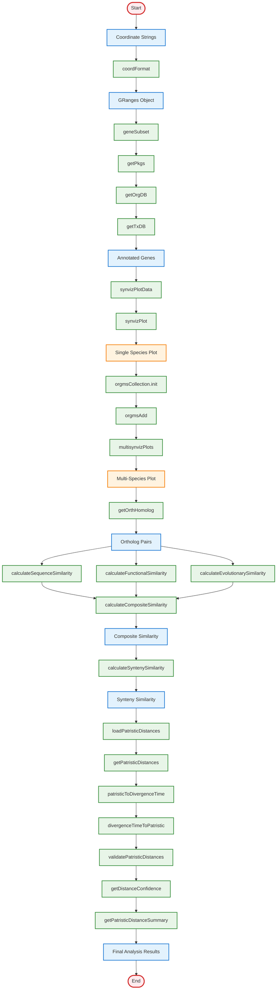

# SyntenyViz Simplified Function Logic Flow

## Core Function Logic and Data Flow

This simplified flowchart shows the essential logic flow between SyntenyViz functions, focusing on the main data processing pipeline.

## Function Logic Summary

### **1. Data Input and Processing**
- **coordFormat**: Converts coordinate strings to GRanges objects
- **geneSubset**: Annotates genes using organism-specific databases
- **getPkgs, getOrgDB, getTxDB**: Manage database access and package dependencies

### **2. Visualization Pipeline**
- **synvizPlotData**: Prepares data for visualization
- **synvizPlot**: Creates single-species synteny plots
- **orgmsCollection.init, orgmsAdd**: Manages multi-species collections
- **multisynvizPlots**: Generates comparative multi-species plots

### **3. Ortholog Analysis**
- **getOrthHomolog**: Identifies orthologous gene pairs across species

### **4. Multi-dimensional Similarity Analysis**
- **calculateSequenceSimilarity**: Sequence-based similarity (40% weight)
- **calculateFunctionalSimilarity**: Functional similarity based on GO terms (35% weight)
- **calculateEvolutionarySimilarity**: Evolutionary distance-based similarity (25% weight)
- **calculateCompositeSimilarity**: Combines all similarity metrics with weights

### **5. Synteny Conservation Analysis**
- **calculateSyntenySimilarity**: Quantifies gene order conservation between species

### **6. Evolutionary Distance Analysis**
- **loadPatristicDistances**: Loads patristic distance database
- **getPatristicDistances**: Retrieves specific species pair distances
- **patristicToDivergenceTime**: Converts distances to divergence times
- **divergenceTimeToPatristic**: Converts times back to distances

### **7. Quality Control and Validation**
- **validatePatristicDistances**: Validates distance data integrity
- **getDistanceConfidence**: Assigns confidence levels to distances
- **getPatristicDistanceSummary**: Generates comprehensive summary statistics

## Key Logic Principles

### **Data Flow Dependencies**
1. **Coordinate Input** → **GRanges Creation** → **Gene Annotation**
2. **Gene Data** → **Visualization** → **Multi-Species Analysis**
3. **Ortholog Data** → **Similarity Calculations** → **Synteny Analysis**
4. **Distance Data** → **Validation** → **Summary Statistics**

### **Function Integration**
- Each function builds upon previous outputs
- Clear input/output specifications
- Modular design allows independent function calls
- Comprehensive error handling throughout

### **Scientific Rigor**
- Multiple validation approaches
- Confidence level assignments
- Uncertainty quantification
- Cross-validation with phylogenetic data

This simplified flowchart provides a clear overview of how data flows through the SyntenyViz package, from initial coordinate input to final comprehensive analysis results.
