# SyntenyViz Comprehensive Workflow Guide

## 🧬 Complete Comparative Genomics Analysis Pipeline

This guide provides a clear, step-by-step overview of the SyntenyViz workflow, showing how genomic data flows through each analysis stage to produce comprehensive comparative genomics insights.

## 📊 Visual Workflow Overview

```mermaid
flowchart TD
    %% Start and Setup
    START([🚀 Start Analysis]) --> SETUP[📦 Load Packages & Libraries]
    
    %% Core Data Pipeline
    SETUP --> INPUT["📍 Input: Genomic Coordinates<br/>Format: 2:16e7:16.5e7"]
    INPUT --> COORD_FORMAT[🔧 coordFormat<br/>Convert to GRanges objects]
    COORD_FORMAT --> GENE_SUBSET[🧬 geneSubset<br/>Extract & annotate genes]
    GENE_SUBSET --> VISUALIZATION[🎨 Visualization Pipeline]
    
    %% Visualization Branch
    VISUALIZATION --> SINGLE_PLOT[🖼️ Single Species Plot<br/>synvizPlot]
    VISUALIZATION --> MULTI_SETUP[🌍 Multi-Species Setup<br/>orgmsCollection.init + orgmsAdd]
    MULTI_SETUP --> MULTI_PLOT[🖼️ Multi-Species Plot<br/>multisynvizPlots]
    
    %% Analysis Pipeline
    SINGLE_PLOT --> ORTHOLOGS[🔗 Ortholog Analysis<br/>getOrthHomolog]
    MULTI_PLOT --> ORTHOLOGS
    ORTHOLOGS --> SIMILARITY[📊 Multi-Dimensional Similarity<br/>Sequence + Functional + Evolutionary]
    SIMILARITY --> SYNTENY[🔄 Synteny Conservation<br/>calculateSyntenySimilarity]
    
    %% Evolutionary Analysis
    SYNTENY --> EVOLUTIONARY[🌳 Evolutionary Analysis]
    EVOLUTIONARY --> EVO_DIST[📂 Evolutionary Distances<br/>loadEvolutionaryDistances]
    EVOLUTIONARY --> PAT_DIST[📂 Patristic Distances<br/>loadPatristicDistances]
    PAT_DIST --> CONVERSIONS[⏰ Distance-Time Conversions<br/>patristicToDivergenceTime<br/>divergenceTimeToPatristic]
    
    %% Quality Control
    CONVERSIONS --> VALIDATION[✅ Quality Control]
    VALIDATION --> VALIDATE[🔍 validatePatristicDistances]
    VALIDATE --> CONFIDENCE[📊 getDistanceConfidence]
    CONFIDENCE --> SUMMARY[📋 getPatristicDistanceSummary]
    
    %% Final Output
    SUMMARY --> FINAL[🎯 Complete Analysis Results<br/>Multi-dimensional genomic insights]
    FINAL --> END([🏁 Analysis Complete])
    
    %% Enhanced Styling
    classDef inputBox fill:#e3f2fd,stroke:#1976d2,stroke-width:3px,color:#000
    classDef processBox fill:#e8f5e8,stroke:#2e7d32,stroke-width:2px,color:#000
    classDef outputBox fill:#fff3e0,stroke:#f57c00,stroke-width:2px,color:#000
    classDef analysisBox fill:#f3e5f5,stroke:#7b1fa2,stroke-width:2px,color:#000
    classDef startEndBox fill:#ffebee,stroke:#d32f2f,stroke-width:4px,color:#000
    
    class INPUT,COORD_FORMAT,GENE_SUBSET inputBox
    class VISUALIZATION,SINGLE_PLOT,MULTI_SETUP,MULTI_PLOT,ORTHOLOGS,SIMILARITY,SYNTENY,EVOLUTIONARY,EVO_DIST,PAT_DIST,CONVERSIONS,VALIDATION,VALIDATE,CONFIDENCE,SUMMARY processBox
    class FINAL outputBox
    class START,END startEndBox
```



## 🔄 **Simplified Data Flow Summary**

### **Core Pipeline (4 Main Steps)**
1. **📥 Input Processing**: Coordinates → GRanges → Gene Annotation
2. **🎨 Visualization**: Single plots + Multi-species comparative plots  
3. **🔬 Analysis**: Orthologs → Similarity → Synteny conservation
4. **🌳 Evolution**: Distance analysis → Validation → Summary

### **Key Function Groups**
- **Data Prep**: `coordFormat()`, `geneSubset()`, `getPkgs()`
- **Visualization**: `synvizPlot()`, `multisynvizPlots()`, `orgmsCollection.init()`
- **Analysis**: `getOrthHomolog()`, `calculate*Similarity()`, `calculateSyntenySimilarity()`
- **Evolution**: `loadPatristicDistances()`, `patristicToDivergenceTime()`
- **Quality**: `validatePatristicDistances()`, `getDistanceConfidence()`

## ⚡ **Function Logic Summary**

### **🔄 Core Data Flow**
```
Input Coordinates → coordFormat() → GRanges → geneSubset() → Annotated Genes
                                                                    ↓
Visualization ← synvizPlot() ← synvizPlotData() ← Annotated Genes
                                                                    ↓
Multi-Species ← multisynvizPlots() ← orgmsAdd() ← orgmsCollection.init()
                                                                    ↓
Ortholog Analysis ← getOrthHomolog() ← Gene Data
                                                                    ↓
Similarity Analysis ← calculate*Similarity() ← Ortholog Pairs
                                                                    ↓
Synteny Analysis ← calculateSyntenySimilarity() ← Similarity Scores
                                                                    ↓
Evolutionary Analysis ← loadPatristicDistances() ← Synteny Results
                                                                    ↓
Quality Control ← validatePatristicDistances() ← Evolutionary Data
```

### **🧬 Function Dependencies**
1. **Foundation**: `coordFormat()` → `geneSubset()` → `getPkgs()`, `getOrgDB()`, `getTxDB()`
2. **Visualization**: `synvizPlotData()` → `synvizPlot()` + `orgmsCollection.init()` → `orgmsAdd()` → `multisynvizPlots()`
3. **Analysis**: `getOrthHomolog()` → `calculateSequenceSimilarity()` + `calculateFunctionalSimilarity()` + `calculateEvolutionarySimilarity()` → `calculateCompositeSimilarity()`
4. **Synteny**: `calculateSyntenySimilarity()` → Overlap + Order calculations
5. **Evolution**: `loadPatristicDistances()` → `getPatristicDistances()` → `patristicToDivergenceTime()` + `divergenceTimeToPatristic()`
6. **Quality**: `validatePatristicDistances()` → `getDistanceConfidence()` → `getPatristicDistanceSummary()`

### **📊 Data Transformation Points**
- **String → GRanges**: `coordFormat()` parses coordinates into genomic intervals
- **GRanges → Genes**: `geneSubset()` extracts and annotates genes from regions
- **Genes → Plots**: `synvizPlotData()` + `synvizPlot()` create visualizations
- **Genes → Orthologs**: `getOrthHomolog()` identifies homologous gene pairs
- **Orthologs → Similarity**: Multiple `calculate*Similarity()` functions quantify relationships
- **Similarity → Synteny**: `calculateSyntenySimilarity()` measures gene order conservation
- **Distances → Time**: `patristicToDivergenceTime()` converts phylogenetic distances to divergence times
- **Data → Validation**: `validatePatristicDistances()` ensures data integrity

## 📋 **Workflow Levels Comparison**

| Level | Focus | Detail | Use Case |
|-------|-------|--------|----------|
| **🔄 Simplified Flow** | Core pipeline | Essential functions only | Quick understanding, basic usage |
| **📊 This Workflow** | Complete process | Phases + functions + examples | Comprehensive guide, learning |
| **🧬 Detailed Logic** | Function internals | Step-by-step logic flow | Development, debugging, customization |

### **🎯 Quick Reference**
- **Start Here**: Use this workflow guide for complete understanding
- **Need Details**: Refer to detailed function logic flowchart for implementation specifics
- **Want Simple**: Use simplified flow for basic pipeline overview
- **Real Example**: See comprehensive workflow dataflow for actual usage patterns

## 📖 Detailed Workflow Description

### 🔧 **Phase 1: Data Input & Preparation**
**Purpose**: Convert raw genomic coordinates into structured data objects
- **Input**: Genomic coordinate strings (e.g., "2:16e7:16.5e7")
- **Key Function**: `coordFormat()` - Converts coordinates to GRanges objects
- **Processing**: Parse chromosome, start, and end positions
- **Output**: Standardized GRanges objects ready for analysis

### 🧬 **Phase 2: Gene Annotation & Database Access**
**Purpose**: Extract and annotate genes from genomic regions
- **Key Functions**: 
  - `getPkgs()` - Manages database package dependencies
  - `geneSubset()` - Extracts genes and adds annotations
- **Processing**: Query gene databases, retrieve gene symbols and coordinates
- **Output**: Annotated gene data with functional information

### 🎨 **Phase 3: Single Species Visualization**
**Purpose**: Create individual synteny plots for each species
- **Key Functions**:
  - `synvizPlotData()` - Prepares visualization data
  - `synvizPlot()` - Generates synteny plots
- **Processing**: Create tracks for genes, genome axis, and ideograms
- **Output**: Publication-ready synteny plots

### 🌍 **Phase 4: Multi-Species Comparative Analysis**
**Purpose**: Enable comparative visualization across multiple species
- **Key Functions**:
  - `orgmsCollection.init()` - Initializes species collection
  - `orgmsAdd()` - Adds species to collection
  - `multisynvizPlots()` - Generates comparative plots
- **Processing**: Coordinate multiple species data for side-by-side comparison
- **Output**: Multi-species comparative synteny plots

### 🔗 **Phase 5: Ortholog Identification & Analysis**
**Purpose**: Identify orthologous genes across species
- **Key Function**: `getOrthHomolog()` - Searches for orthologous gene pairs
- **Processing**: Query ortholog databases, identify gene relationships
- **Output**: Ortholog gene pairs with relationship confidence scores

### 📊 **Phase 6: Multi-Dimensional Similarity Analysis**
**Purpose**: Calculate comprehensive similarity metrics
- **Key Functions**:
  - `calculateSequenceSimilarity()` (40% weight) - DNA/protein sequence similarity
  - `calculateFunctionalSimilarity()` (35% weight) - GO term functional similarity
  - `calculateEvolutionarySimilarity()` (25% weight) - Evolutionary distance similarity
  - `calculateCompositeSimilarity()` - Combines all metrics
- **Processing**: Multi-dimensional similarity assessment with weighted scoring
- **Output**: Comprehensive similarity scores for gene pairs

### 🔄 **Phase 7: Synteny Conservation Analysis**
**Purpose**: Quantify gene order conservation across species
- **Key Function**: `calculateSyntenySimilarity()` - Core synteny analysis
- **Processing**: 
  - Calculate overlap scores (ortholog presence)
  - Calculate order scores (gene arrangement conservation)
  - Integrate overall synteny metrics
- **Output**: Synteny conservation metrics and scores

### 🌍 **Phase 8: Evolutionary Distance Analysis**
**Purpose**: Analyze evolutionary relationships using distance data
- **Key Functions**:
  - `loadEvolutionaryDistances()` - Loads evolutionary distance database
  - `getEvolutionaryDistances()` - Retrieves specific species distances
- **Processing**: Access and analyze normalized evolutionary distances
- **Output**: Evolutionary relationship analysis results

### 🌳 **Phase 9: Patristic Distance Analysis**
**Purpose**: Perform tree-based evolutionary distance calculations
- **Key Functions**:
  - `loadPatristicDistances()` - Loads patristic distance database
  - `getPatristicDistances()` - Retrieves species pair distances
  - `patristicToDivergenceTime()` - Converts distances to time
  - `divergenceTimeToPatristic()` - Converts time to distances
- **Processing**: Tree-based distance calculations and time conversions
- **Output**: Patristic distance analysis with temporal context

### ✅ **Phase 10: Validation & Quality Control**
**Purpose**: Ensure data integrity and assign confidence levels
- **Key Functions**:
  - `validatePatristicDistances()` - Validates distance data integrity
  - `getDistanceConfidence()` - Assigns confidence levels
  - `getPatristicDistanceSummary()` - Generates comprehensive summary
- **Processing**: Data validation, confidence assessment, summary generation
- **Output**: Validated analysis results with quality metrics

### 🗄️ **Phase 11: Database Management**
**Purpose**: Manage species-specific database resources
- **Key Functions**:
  - `orgmOrgDB()` - Lists available organisms
  - `orgmTxDB()` - Lists transcriptome databases
- **Processing**: Database resource management and availability checking
- **Output**: Database resource management information

### 🛠️ **Phase 12: Error Handling & Diagnostics**
**Purpose**: Provide robust error management and troubleshooting
- **Key Functions**:
  - `diagnostics_function()` - Runs comprehensive diagnostics
  - `tryCatch()` - Graceful error management
- **Processing**: Error detection, graceful handling, debugging support
- **Output**: Robust analysis pipeline with comprehensive error handling

## 🔗 Key Functional Connections

### 📊 **Data Flow Dependencies**
1. **Coordinate Formatting** → **Gene Annotation** → **Visualization**
   - Raw coordinates become structured genomic data
   - Gene data enables meaningful visualizations

2. **Gene Data** → **Ortholog Search** → **Similarity Calculations**
   - Annotated genes enable ortholog identification
   - Ortholog data feeds into multi-dimensional similarity analysis

3. **Ortholog Data** → **Synteny Analysis** → **Evolutionary Analysis**
   - Ortholog relationships enable synteny conservation analysis
   - Synteny data integrates with evolutionary distance analysis

4. **Distance Data** → **Tree Validation** → **Quality Control**
   - Distance calculations feed into phylogenetic validation
   - Validation ensures data integrity and quality

### 🔄 **Cross-Functional Integration**
- **Multi-species analysis** integrates data from all species for comprehensive comparison
- **Similarity calculations** combine multiple data sources (sequence, function, evolution)
- **Evolutionary analysis** validates against phylogenetic trees and fossil evidence
- **Error handling** provides robustness throughout the entire pipeline

### 📈 **Output Integration**
- **Visual outputs** support interpretation of quantitative results
- **Statistical outputs** provide quantitative validation of biological hypotheses
- **Summary outputs** integrate all analysis components into comprehensive reports

## 🧬 Scientific Workflow Principles

### 1. **Modularity** 🔧
- Each phase can be run independently
- Functions are self-contained and reusable
- Easy to modify or extend specific components

### 2. **Integration** 🔗
- Each phase builds upon previous results
- Seamless data flow between analysis stages
- Comprehensive integration of multiple data types

### 3. **Validation** ✅
- Multiple validation approaches at each stage
- Cross-validation between different analysis methods
- Quality control measures throughout the pipeline

### 4. **Flexibility** ⚙️
- Customizable parameters for different research needs
- Support for various species and genomic regions
- Adaptable to different analysis requirements

### 5. **Robustness** 🛡️
- Comprehensive error handling and debugging support
- Graceful failure modes and recovery mechanisms
- Extensive diagnostic capabilities

## 🎯 **Workflow Summary**

This comprehensive workflow represents a complete comparative genomics analysis pipeline that:

- **Integrates multiple biological perspectives** (sequence, function, evolution, synteny)
- **Provides comprehensive insights** into gene conservation, evolution, and synteny across species
- **Supports both basic research** and applied comparative genomics studies
- **Enables publication-ready visualizations** and quantitative analyses
- **Maintains scientific rigor** through validation and quality control measures

The SyntenyViz package provides researchers with a powerful, user-friendly tool for conducting sophisticated comparative genomics analyses that would otherwise require extensive bioinformatics expertise and custom scripting.

## 🚀 Quick Start Guide

### **Basic Usage Example**
```r
# 1. Load the package
library(SyntenyViz)

# 2. Define genomic coordinates
coords <- list("2:16e7:16.5e7", "2:16e7:16.5e7")

# 3. Format coordinates
granges <- coordFormat(coords)

# 4. Extract genes
genes <- geneSubset(granges, "Homo_sapiens")

# 5. Create synteny plot
plot_data <- synvizPlotData(granges, "Homo_sapiens")
synvizPlot(plot_data)
```

### **Multi-Species Analysis**
```r
# 6. Initialize multi-species collection
collection <- orgmsCollection.init()

# 7. Add species
collection <- orgmsAdd(collection, "Homo_sapiens", granges)
collection <- orgmsAdd(collection, "Mus_musculus", granges)

# 8. Generate comparative plots
multisynvizPlots(collection)
```

### **Ortholog Analysis**
```r
# 9. Find orthologs
orthologs <- getOrthHomolog("Homo_sapiens", "Mus_musculus", genes)

# 10. Calculate similarities
seq_sim <- calculateSequenceSimilarity(orthologs)
func_sim <- calculateFunctionalSimilarity(orthologs)
evo_sim <- calculateEvolutionarySimilarity(orthologs)
composite <- calculateCompositeSimilarity(seq_sim, func_sim, evo_sim)
```

## 📚 Function Reference

| Phase | Function | Purpose | Input | Output |
|-------|----------|---------|-------|--------|
| **Data Prep** | `coordFormat()` | Convert coordinates to GRanges | Coordinate strings | GRanges objects |
| **Annotation** | `geneSubset()` | Extract and annotate genes | GRanges, organism | Annotated gene data |
| **Visualization** | `synvizPlot()` | Create synteny plots | Plot data | Synteny plots |
| **Multi-species** | `multisynvizPlots()` | Comparative visualization | Species collection | Multi-species plots |
| **Orthologs** | `getOrthHomolog()` | Find orthologous genes | Species pair, genes | Ortholog pairs |
| **Similarity** | `calculateCompositeSimilarity()` | Multi-dimensional similarity | Individual similarities | Composite scores |
| **Synteny** | `calculateSyntenySimilarity()` | Synteny conservation | Ortholog data | Synteny metrics |
| **Evolution** | `getPatristicDistances()` | Evolutionary distances | Species pair | Distance values |
| **Validation** | `validatePatristicDistances()` | Data validation | Distance data | Validation results |

## 🔍 Troubleshooting

### **Common Issues**
- **Package dependencies**: Use `install_dependencies()` to install required packages
- **Database access**: Check `orgmOrgDB()` and `orgmTxDB()` for available organisms
- **Error handling**: Use `diagnostics_function()` for comprehensive diagnostics
- **Memory issues**: Process smaller genomic regions or use fewer species

### **Getting Help**
- Check function documentation: `?function_name`
- Run diagnostics: `diagnostics_function()`
- Validate data: `validatePatristicDistances()`
- Check package status: `getPkgs()`
