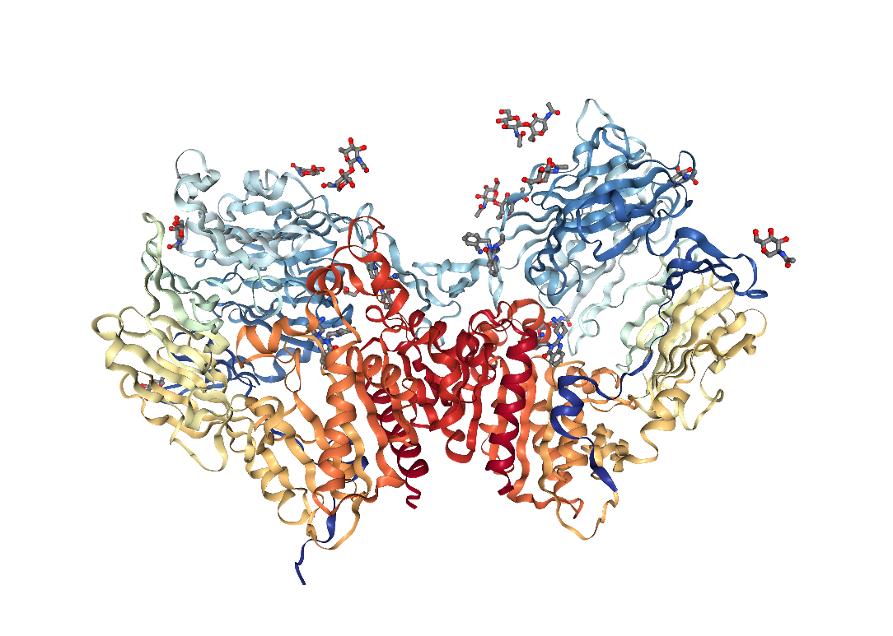

```{r, include = FALSE}
knitr::opts_chunk$set(
  collapse = TRUE,
  comment = "#>", 
  error = TRUE
)
```

```{r setup}
library(SyntenyViz)
```

The course below demonstrates a standard analysis pipeline with the `SyntenyViz` R package. 

# For the inpatients 
Quick and minimum steps to get start a synteney conservation anaysis with SyntenyViz

* Define an investigation range 
We need to firstly define an investigation range to cover the target range in gene coordinate. We will use a mouse dipeptidyl dipeptidase 4 gene (DPP4-mm) in this example, where DPP4-mm locates at chromosome number 2 between 62,330,073-62,412,231 bp.  
```{r}
# orgm is a handle for organism
orgmName <- "Mmusculus"
# mycoords.list is the investigation range handler
mycoords <- "2:6.0e7:6.5e7"
```
* Convert `mycoords.list` into a GRange object
```{r}
mycoords.gr <- SyntenyViz::coordFormat (mycoords.list = mycoords)
```
It is always a good habit to double check the input, so 
```{r}
mycoords.gr
```

* Construct a single synteny graph 
```{r, out.width='90%', fig.cap = 'Synteny of Mouse DPP4', fig.pos = 'h', include=TRUE}
synvizPlotData(mycoords.gr, orgmName)
synvizPlot(mycoords.gr, orgmName)
```

* Construct a multi synteny graph 

Pick a few of targets
```{r echo=FALSE, warning=FALSE}
orgm.1 <- "Hsapiens"
mycoords.list.1 <- "2:15.95e7:16.45e7"
orgm.2 <- "Mmusculus"
mycoords.list.2 <- "2:6.0e7:6.5e7"
orgm.3 <- "Rnorvegicus"
mycoords.list.3 <- "3:4.6e7:5.1e7"
```
Then construct a multiple synteny query 
```{r}
orgmsList <- orgmsCollection.init (orgmsList)
orgmsList <- orgmsAdd (orgm.1, orgmTxDB, mycoords.list.1, orgmsList)
orgmsList <- orgmsAdd (orgm.2, orgmTxDB, mycoords.list.2, orgmsList)
orgmsList <- orgmsAdd (orgm.3, orgmTxDB, mycoords.list.3, orgmsList)
```
Now, construct a comparative multi-synteny graph
```{r, out.width='80%', fig.cap = 'Multi Synteny Plot of DPP4', fig.pos = 'h', include=TRUE}
multiplot <- multisynvizPlots(orgmsList)
```

# The Nitty Gritty of Synteny Analysis 
## Construct A Search Query 
A search query includes the information of target organism(s) and the region(s) of interests. A typical work flow starts by locating the gene of interests. In this example, we will use a protease gene dipeptidyl dipeptidase-4 (DPP4) as a target. 

### DPP4 background 
DPP4 is also known by a few other names including adenosine deaminase complexing protein 2 (ADCP2) and CD26. Human DPP4 gene encodes a 766 amino acids protein. DPP4 proteins dimmerise and then possesses potent rare post-proline hydrolytic activity _in situ_. In clinics, DPP4 has been demonstrated to involve in many important physiobiological functions including homeostasis, adaptive immune responses and numerous cancer biology. Due to its degradation property towards GLP and GIP, pharmacologically, DPP4 inhibitors have been prescribed as an alternative treatment to type 2 diabetics. 

```{r, out.width='90%', fig.align='center', fig.cap = 'DPP4 protein in dimmer form', fig.pos = 'h' }

```

### Locate DPP4 gene and define the investigation ranges
#### Locate gene (e.g. DPP4 gene)
To locate DPP4 gene, both [Ensemble](http://www.ensembl.org/index.html) and [GeneBank](https://www.ncbi.nlm.nih.gov/gene) are good resources for this purpose. 

Let's say we want to find the location of __human DPP4 gene__ location. 

* [Ensemble query](https://www.ensembl.org/Homo_sapiens/Gene/Summary?g=ENSG00000197635;r=2:161992245-162074215) 
* [GeneBank query](https://www.ncbi.nlm.nih.gov/gene/1803) 

indicate human DPP4 gene is located on __chromosome 2__ between __161992245-162074215 bp__. 

#### Define the investigation ranges
Given that human DPP4 related genes are clustered closely and we only interested in the synteny of DPP4 gene in this case, therefore, __0.25e7 bp__ on either side of DPP4 gene seems a good fit (i.e. __15.95e7-16.45e7__ bp will be the investigation range).  

Hence, we can now define the investigation range as 
```{r}
# orgm is a handle for organism
orgm <- "Hsapiens"
# mycoords.list is the investigation range handler
mycoords.list <- "2:15.95e7:16.45e7"
```
then we need to convert `mycoords.list` into a squence coordinate in GRange object, here we can call a convertion function
```{r}
# Return mycoords.gr as a GRange object
mycoords.gr <- coordFormat (mycoords.list = mycoords.list)
```

## 

